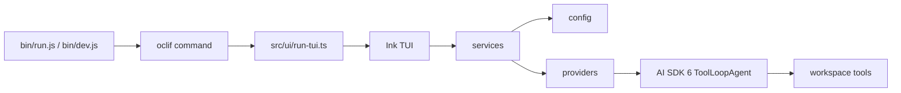

# AICE CLI

<p align="center">
  <strong>A DeepSeek-first terminal coding agent built on AI SDK 6, oclif, and Ink.</strong>
</p>

<p align="center">
  English
  ·
  <a href="./README.zh-CN.md">简体中文</a>
  ·
  <a href="./TODO.md">Roadmap</a>
  ·
  <a href="https://github.com/ch1lam/aice-cli/issues">Issues</a>
</p>

<p align="center">
  <a href="./LICENSE"></a>
  = 18" src="https://img.shields.io/badge/node-%3E%3D18-339933">
  
  
  
</p>

AICE is a focused CLI for building and testing agent workflows in a real
terminal. It is intentionally narrow today: one provider path, one interactive
TUI entry point, and a small set of read-only workspace tools. The goal is to
make the DeepSeek experience reliable before adding breadth.

This project is pre-1.0 and actively maintained. Breaking changes are allowed
while the core agent loop, terminal UX, and configuration model are still being
hardened. Progress is tracked in [TODO.md](./TODO.md) so the current state is
visible instead of hidden behind a polished README.

## What Works Today

- DeepSeek chat and reasoning models through Vercel AI SDK 6.
- `ToolLoopAgent` runtime with bounded, read-only workspace tools.
- Ink-based interactive TUI launched by `aice` with no arguments.
- First-run setup for API key, optional base URL, optional model override, and
  connectivity validation.
- Streaming assistant output, tool progress messages, provider metadata, stream
  status, and token usage in the terminal UI.
- Slash commands for the core session flow: `/help`, `/login`, `/model`, and
  `/new`.
- Tests for provider streaming, setup/config persistence, workspace tools, chat
  message conversion, and Ink UI behavior.

## Not Finished Yet

- No provider picker or multi-provider runtime. DeepSeek is the only supported
  provider.
- Workspace tools are read-only. AICE can inspect files, list files, search
  files, and read the clock, but it does not edit files for you yet.
- No stable plugin API, background job system, or non-interactive automation
  mode.
- No 1.0 compatibility contract. Environment names, command shape, and UI
  details may change before the project settles.
- Contributor-facing docs are still light. The internal architecture guide is in
  [AGENTS.md](./AGENTS.md), and public docs will expand as the surface stabilizes.

## Quick Start

### Requirements

- Node.js 18 or newer
- Yarn 1.x
- A DeepSeek API key

### Run From Source

```bash
git clone https://github.com/ch1lam/aice-cli.git
cd aice-cli
yarn install
node bin/dev.js
```

The development entry uses `tsx` and opens the same TUI as the installed `aice`
binary. The TUI requires a real terminal because Ink needs raw keyboard input.

### Configure DeepSeek

On first run, AICE can guide you through setup and write `.env` for you. You can
also create it manually:

```dotenv
DEEPSEEK_API_KEY=sk-deep-...
DEEPSEEK_BASE_URL=https://api.deepseek.com
DEEPSEEK_MODEL=deepseek-chat
```

`DEEPSEEK_BASE_URL` and `DEEPSEEK_MODEL` are optional. The default model is
`deepseek-chat`; the model menu also exposes `deepseek-reasoner`.

Legacy `AICE_*` provider variables are intentionally not kept. When AICE writes
`.env`, it removes the old provider keys and persists the DeepSeek-specific
configuration.

## Usage

```bash
# Development checkout
node bin/dev.js

# Installed package binary
aice

# Command help
aice --help
```

Inside the TUI:

| Command | Purpose |
| --- | --- |
| `/help` | Show available slash commands. |
| `/login` | Restart setup and re-enter provider credentials. |
| `/model` | Open the DeepSeek model menu. |
| `/new` | Start a fresh session. |

Plain input is sent to the active session. While the model is running, AICE
streams text, shows tool progress, and updates the status bar with provider,
model, status, and token usage when the provider reports it.

## Workspace Tools

AICE uses AI SDK 6 `ToolLoopAgent` with a deliberately small tool surface:

| Tool | Capability |
| --- | --- |
| `read_file` | Read UTF-8 files inside the workspace with optional line ranges. |
| `list_files` | List files under a workspace path using `rg --files`. |
| `search_files` | Search workspace text using ripgrep. |
| `get_current_time` | Return local and UTC timestamps. |

Tool paths are resolved inside the workspace root. Traversal outside that root
is rejected, and file/search output is bounded so the terminal stays usable.

## Architecture



Project layout:

| Path | Responsibility |
| --- | --- |
| `bin/` | Runtime shims for production and `tsx` development. |
| `src/commands/` | oclif command entry points. |
| `src/ui/` | Ink components, hooks, slash commands, and rendering utilities. |
| `src/services/` | Side-effect orchestration for chat streams and setup persistence. |
| `src/providers/` | DeepSeek adapter, AI SDK integration, and connectivity checks. |
| `src/agents/` | Tool factories used by the agent runtime. |
| `src/config/` | Provider defaults, model list, and `.env` load/persist logic. |
| `src/chat/` | Chat-history to model-message conversion. |
| `src/core/` | Shared error normalization and core utilities. |
| `src/types/` | Shared TypeScript contracts without runtime side effects. |
| `test/` | Mocha/Chai and Ink test coverage mirroring `src/`. |

Dependency direction is intentionally simple:

```text
commands/ui -> services -> config/providers/core/types
```

Keep provider and core code independent of Ink and oclif. Put side effects in
commands or focused services so provider logic and UI hooks stay testable.

## Development

```bash
yarn build
yarn test
yarn lint
```

| Command | Purpose |
| --- | --- |
| `yarn build` | Remove `dist/` and compile with `tsc -b`. |
| `yarn test` | Run the Mocha suite; `posttest` runs lint afterwards. |
| `yarn lint` | Run ESLint directly while iterating. |
| `node bin/dev.js` | Launch the TUI in development mode. |
| `yarn prepack` | Refresh oclif package artifacts before publishing. |

When changing the TUI, include terminal evidence in the PR description when
possible. When changing provider behavior, add tests around stream chunk order,
error propagation, and setup failures.

## Maintenance Model

AICE is maintained in small, reviewable steps:

- `TODO.md` is the public maintenance ledger.
- Finished work is checked off instead of deleted, so project direction stays
  visible.
- Before 1.0, breaking old formats is acceptable when it keeps the architecture
  cleaner.
- Tests are the safety net for refactors. Behavior changes should move with
  focused regression coverage.
- New side effects should live in command runners or services, not in providers
  or UI components.

## Contributing

1. Pick a narrow change and keep the current DeepSeek path working.
2. Add or update tests under `test/`.
3. Run `yarn build && yarn test`.
4. Open a PR that explains the scenario, the provider path exercised, and any
   visible terminal UI changes.

For repo-specific architecture rules, read [AGENTS.md](./AGENTS.md).

## License

Apache-2.0. See [LICENSE](./LICENSE).
