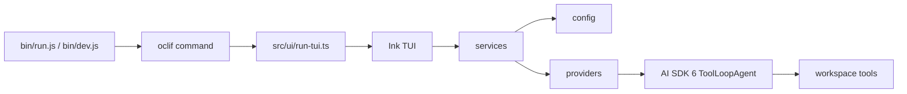

# AICE CLI

<p align="center">
  <strong>基于 AI SDK 6、oclif 和 Ink 的 DeepSeek 优先终端 Coding Agent。</strong>
</p>

<p align="center">
  <a href="./README.md">English</a>
  ·
  简体中文
  ·
  <a href="./TODO.md">Roadmap</a>
  ·
  <a href="https://github.com/ch1lam/aice-cli/issues">Issues</a>
</p>

AICE 现在是一个刻意收窄范围的 CLI：只做 DeepSeek 路径、只保留交互式 TUI 入口、只提供小而明确的只读工作区工具。当前目标不是堆 provider 数量，而是先把 DeepSeek + 终端 Agent 体验打磨稳定。

项目还没有到 1.0，但不是随时丢弃的实验残留。当前迁移和维护进度都记录在 [TODO.md](./TODO.md)，已完成和未完成的边界会直接写出来。

## 当前已经完成

- 通过 Vercel AI SDK 6 接入 DeepSeek chat / reasoner 模型。
- 使用 `ToolLoopAgent` 作为运行时，并接入受限的只读工作区工具。
- `aice` 无参数默认进入 Ink TUI。
- 首次启动可以配置 API Key、可选 Base URL、可选模型，并做连通性验证。
- 支持流式输出、工具进度、provider/model 状态、运行状态和 token usage 展示。
- 支持 `/help`、`/login`、`/model`、`/new` 四个核心 slash commands。
- 已有 provider、setup/config、workspace tools、chat message、Ink UI 等测试覆盖。

## 当前还没完成

- 没有多 provider 选择器。当前只支持 DeepSeek。
- 工作区工具只有只读能力：读文件、列文件、搜索文件、读取时间；还不能直接改文件。
- 没有稳定插件 API、后台任务系统或非交互式自动化模式。
- 还没有 1.0 兼容性承诺。1.0 前环境变量、命令形态、UI 细节都可能变化。
- 面向外部贡献者的文档仍在补齐中；更细的本仓库架构规则在 [AGENTS.md](./AGENTS.md)。

## 快速开始

### 环境要求

- Node.js 18 或更新版本
- Yarn 1.x
- DeepSeek API Key

### 从源码运行

```bash
git clone https://github.com/ch1lam/aice-cli.git
cd aice-cli
yarn install
node bin/dev.js
```

开发入口使用 `tsx`，启动的是和正式 `aice` 二进制一致的 TUI。由于 Ink 需要原始键盘输入，必须在真实终端里运行。

### 配置 DeepSeek

首次启动时 AICE 可以引导你写入 `.env`，也可以手动创建：

```dotenv
DEEPSEEK_API_KEY=sk-deep-...
DEEPSEEK_BASE_URL=https://api.deepseek.com
DEEPSEEK_MODEL=deepseek-chat
```

`DEEPSEEK_BASE_URL` 和 `DEEPSEEK_MODEL` 都是可选项。默认模型是 `deepseek-chat`，模型菜单也提供 `deepseek-reasoner`。

旧的 `AICE_*` provider 变量不会继续保留。AICE 写入 `.env` 时会清理这些旧键，并保存 DeepSeek 专用配置。

## 使用方式

```bash
# 开发环境
node bin/dev.js

# 安装后的命令
aice

# 查看帮助
aice --help
```

TUI 内部命令：

| 命令 | 作用 |
| --- | --- |
| `/help` | 查看可用 slash commands。 |
| `/login` | 重新进入凭据配置流程。 |
| `/model` | 打开 DeepSeek 模型菜单。 |
| `/new` | 开启新会话。 |

普通输入会发送给当前会话。模型运行时，AICE 会流式展示回答、工具进度，并在状态栏更新 provider、model、运行状态和 token usage。

## 工作区工具

当前工具面保持很小：

| 工具 | 能力 |
| --- | --- |
| `read_file` | 读取工作区内 UTF-8 文件，支持行范围。 |
| `list_files` | 用 `rg --files` 列出工作区文件。 |
| `search_files` | 用 ripgrep 搜索工作区文本。 |
| `get_current_time` | 返回本地时间和 UTC 时间。 |

所有路径都会限制在工作区根目录内，越界访问会被拒绝。文件和搜索输出也有上限，避免终端被大结果撑爆。

## 架构



目录职责：

| 路径 | 职责 |
| --- | --- |
| `bin/` | 生产和开发模式的运行入口。 |
| `src/commands/` | oclif 命令入口。 |
| `src/ui/` | Ink 组件、hooks、slash commands 和渲染工具。 |
| `src/services/` | chat stream、setup 持久化等副作用编排。 |
| `src/providers/` | DeepSeek adapter、AI SDK 集成、连通性检查。 |
| `src/agents/` | Agent runtime 使用的工具工厂。 |
| `src/config/` | provider 默认值、模型列表、`.env` 读写。 |
| `src/chat/` | chat history 到 model messages 的转换。 |
| `src/core/` | 共享错误归一化和核心工具。 |
| `src/types/` | 无副作用的共享 TypeScript 类型。 |
| `test/` | Mocha/Chai 和 Ink 测试。 |

依赖方向保持简单：

```text
commands/ui -> services -> config/providers/core/types
```

provider 和 core 不应该依赖 Ink 或 oclif。副作用应放在命令或 service 中，让 provider 逻辑和 UI hooks 保持可测试。

## 开发

```bash
yarn build
yarn test
yarn lint
```

| 命令 | 作用 |
| --- | --- |
| `yarn build` | 清理 `dist/` 并执行 `tsc -b`。 |
| `yarn test` | 执行 Mocha 测试，随后通过 `posttest` 跑 lint。 |
| `yarn lint` | 单独运行 ESLint。 |
| `node bin/dev.js` | 以开发模式启动 TUI。 |
| `yarn prepack` | 发布前刷新 oclif package artifacts。 |

## 维护方式

- `TODO.md` 是公开维护账本。
- 完成的条目会保留勾选状态，而不是删除，让项目方向保持可见。
- 1.0 前可以接受破坏旧格式，只要它能让架构更清楚。
- 重构要靠测试兜底，行为变更应补充聚焦的回归测试。
- 新副作用应放进 command runner 或 service，不要塞进 provider 或 UI 组件。

## 贡献

1. 选择小而明确的改动，并保持当前 DeepSeek 路径可用。
2. 在 `test/` 下补充或更新测试。
3. 运行 `yarn build && yarn test`。
4. PR 中说明场景、验证过的 provider 路径，以及可见的 TUI 改动。

更具体的仓库规则见 [AGENTS.md](./AGENTS.md)。

## License

Apache-2.0. See [LICENSE](./LICENSE).
