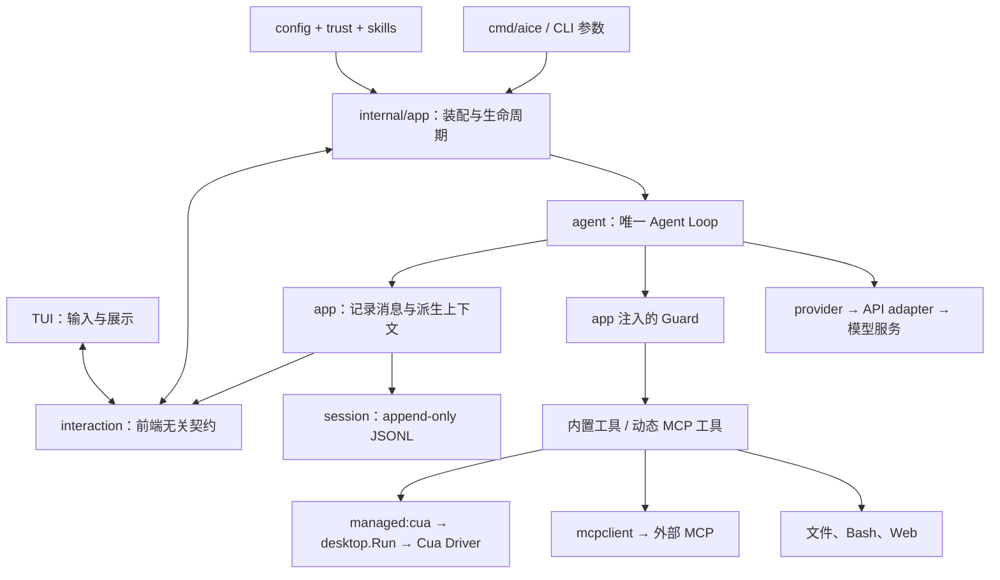
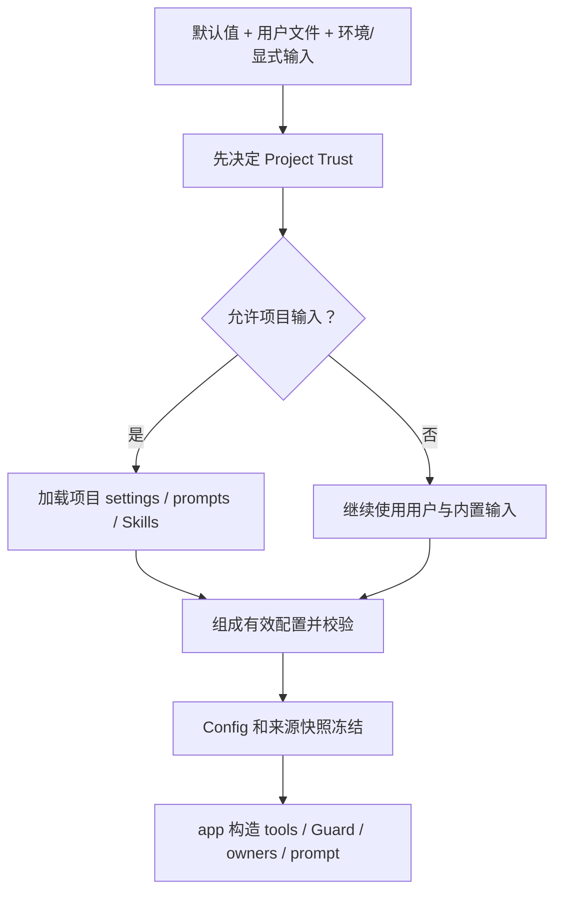
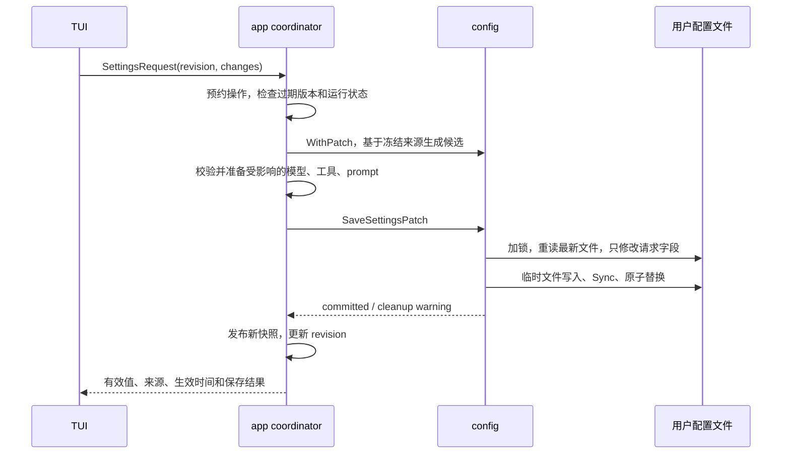
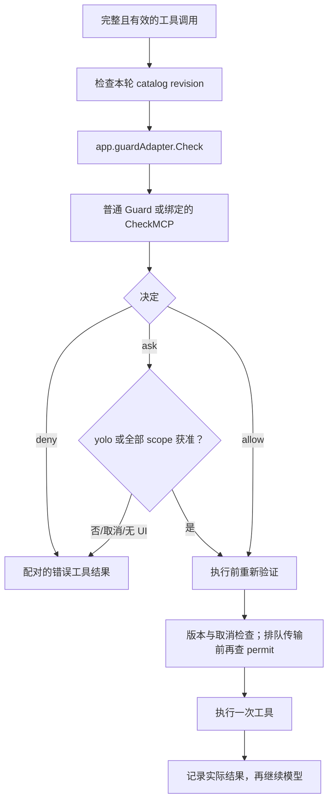
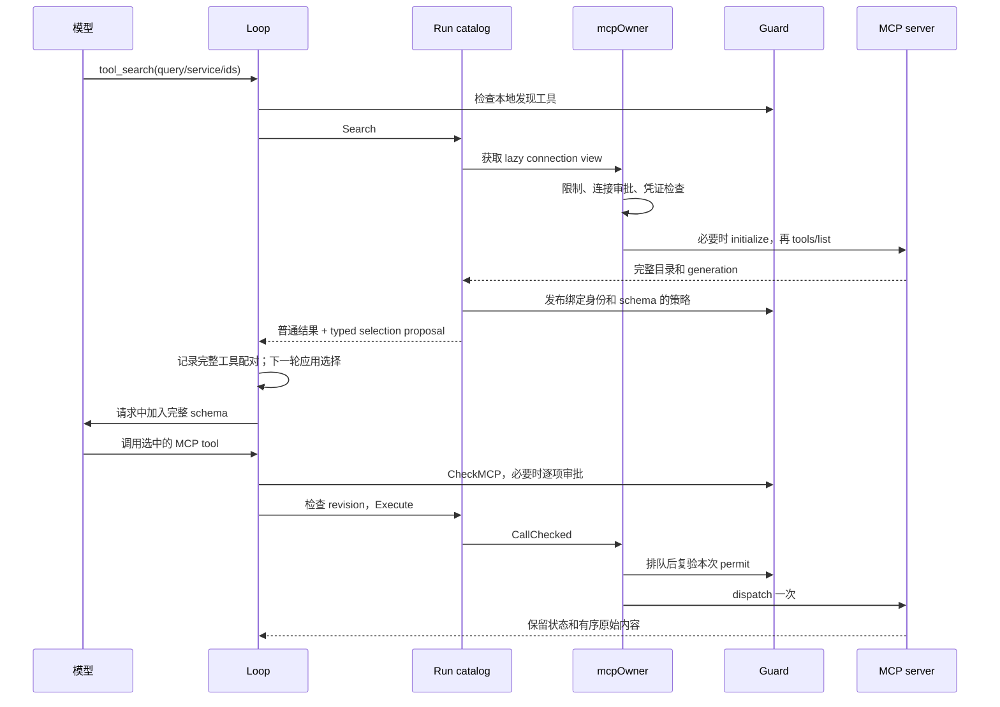
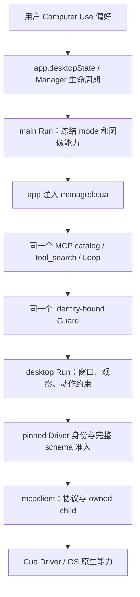
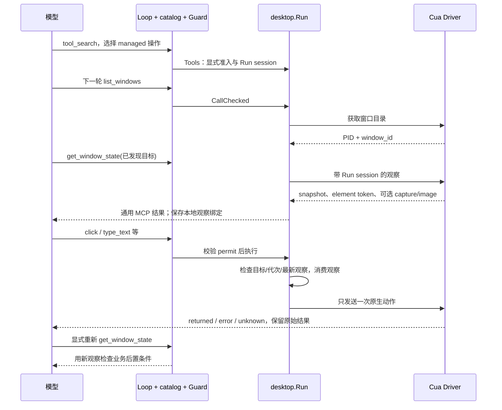

# AICE 架构交接：配置、门控、MCP 与 Computer Use

本文用于接手代码：说明请求经过哪里、状态由谁持有、何时失效，以及出问题先看哪里。核对基线为 `5c64f62`。行为契约仍由 [Architecture](architecture.md)、[Configuration](configuration.md)、[Execution](execution-sessions.md)、[MCP](mcp.md) 和 [Computer Use](desktop.md) 分别维护；本文不另建一套契约。

## 1. 先建立整个系统的地图

AICE 是一个 Go 模块、一个 AICE 二进制。`internal/app` 显式装配依赖，`internal/agent` 的 Loop 决定模型调用、工具执行、继续和停止，`internal/session` 保存追加式 JSONL 历史。宿主工具可以启动辅助子进程；Cua Driver 是原生辅助程序。



图中的 Guard 是调用关系，不表示 Loop 依赖具体 `guard` 包。接口由消费者 `agent` 定义，具体实现经 app adapter 注入。

| 模块 | 接手后应该在这里做的改动 | 不应承担的事 |
| --- | --- | --- |
| `app` | 构造依赖、管理配置发布、Run、Session、连接、取消和关闭 | 再造一个模型循环 |
| `agent` | 模型轮次、工具配对、审批检查、动态工具选择、重试及停止 | 读用户配置、打开 Session 文件、操作 TUI、调用具体 SDK |
| `llm` | AICE 自有消息、模型、工具、事件相关值类型 | provider 私有 wire 格式 |
| `provider` / `api` | 前者管凭证和模型能力；后者管协议转换 | 决定 Session 身份或业务权限 |
| `config` | 来源、类型、有效快照、原子持久化 | 启动桌面、连接 MCP、替换正在跑的任务 |
| `guard` | 当前策略、内存授权、每次调用的判断 | OS 沙箱、UI、网络 I/O |
| `mcpclient` | 一条连接的协议、发现、调用、取消、清理 | 自动审批、读取配置、注册模型工具 |
| `desktop` | 原生服务准入、窗口身份、观察与动作、原生生命周期 | 自己保存用户偏好、选择模型、写第二份历史 |
| `tui` | 界面草稿、状态展示、收集用户选择 | 持久化对话真相、授予执行权限 |

入口是 [app.go](../internal/app/app.go) 的 `NewCommand`、`loadRunModel`、`prepareRunEnvironment`、`Print`、`Interactive`；主循环从 [loop.go](../internal/agent/loop.go) 看起。

### 几种生命周期不能混用

| 名称 | 含义 | 与其他生命周期的关系 |
| --- | --- | --- |
| Process | 一次 AICE 进程 | 可以打开/切换 Session，拥有 managers |
| Session | 一个可恢复的 JSONL 消息树 | 可跨进程恢复；内存授权不随历史恢复 |
| Agent Run | 一次 `Loop.Run` | 可包含初始任务、steering、排队 follow-up 和多个模型轮次 |
| Model round | 一个 assistant 响应及其配对工具结果 | 工具全部配对后才是安全的选择/上下文边界 |
| MCP owner | 已授权连接的应用所有者 | interactive 中可跨 Run 复用 |
| MCP catalog | 某个 Run 的服务成员和可执行版本 | 不跨 Run 继承选择，也不拥有 borrowed transport |
| Cua native session | Driver 中的临时会话 | 不等于 AICE Session；Run 创建、结束自己的标签 |
| Observation | 某窗口在某代连接上的观察依据 | 动作消费后或失效后不能再次执行 |

Session 是唯一持久对话来源。模型上下文、压缩视图、TUI 都是派生结果；恢复旧工具结果不会恢复 MCP schema 选择、执行许可或桌面 token。

## 2. 配置：来源、有效快照和保存偏好是三件事

### 2.1 普通标量优先级

从高到低：

```text
本实例显式 runtime 设置
  > 明确传入的 flag
  > 支持的环境变量
  > 已信任项目 .aice/settings.json
  > ~/.aice/auth.json
  > ~/.aice/settings.json
  > 默认值
```

每次加载使用实例自己的 Viper。`app.bindFlags` 只绑定明确 `Changed` 的 flag，未输入的 flag 默认值不会压住配置。`Settings` 是文件 schema；`Config` 是应用有效快照，内部还保留冻结的来源层和环境输入。

`--workspace`、`--session`、`--approve`、`--no-approve`、`--yolo` 是独立的调用控制项，不能全部按上面的偏好层次理解。

`auth.json` 通常放密钥，但普通标量解析允许它包含其他 Settings 字段，所以其中普通配置也可能盖过 `settings.json`。OAuth、Web、MCP 的专属命名空间另有处理。

文件语法坏掉时整层跳过并给 diagnostic；最终获胜值类型或业务规则非法则失败，不偷偷降级。低层非法值被高层合法值覆盖时不阻止加载。未知有效字段报错；空环境变量不贡献配置。`false`、`0`、空数组与“没有设置”不同。

模型名和 requested thinking 还要经过 provider catalog 解释。有效 thinking 会按模型能力约束，原偏好不应因为一次 clamp 被覆盖掉。

代码：[config.go](../internal/config/config.go) 的 `LoadFiles`，以及 [providers.go](../internal/app/providers.go) 的 `resolveModelSettings`。

### 2.2 Trust 插在读取项目配置之前



受保护资源：根 `AGENTS.md`、`.aice/SYSTEM.md`、`.aice/APPEND_SYSTEM.md`、`.aice/settings.json`、`.agents/skills/`。空 Skills 目录也触发检查，Session 目录不触发。

有受保护资源时，Trust 顺序是：显式 approve/no-approve → 最近祖先目录保存的决定 → 用户/环境的默认 Trust → 可用的交互询问。默认 ask 的非交互运行跳过项目输入继续任务。项目不能用自己的 `default_project_trust=always` 给自己授权。

项目三种 prompt 文件的读取有 `os.Root`、普通文件、UTF-8、64 KiB 限制；这不等于普通文件工具被沙箱化。项目 settings 批准后用普通文件系统读取，Skills 后续扫描使用 `os.DirFS`，不能把 prompt 的 confinement 承诺扩展给全部文件。

prompt 基础选择：可信项目 SYSTEM → 用户 SYSTEM → 内置；随后追加可信项目 AGENTS，再追加项目或用户 APPEND_SYSTEM，最后附 Skills 名称与说明目录。Skill 正文通过工具按需加载。自定义 SYSTEM 会替换基础提示内容，但不会替换 Guard。

`/trust` 只保存给下次启动使用，不热重载当前项目输入。代码：[project_trust.go](../internal/app/project_trust.go)、[resolver.go](../internal/trust/resolver.go)、[project_prompt.go](../internal/app/project_prompt.go)。

### 2.3 三类特殊配置

| 类型 | 来源规则 | 为什么不能普通 deep merge |
| --- | --- | --- |
| Computer Use | `desktop_enabled`、`desktop_control_mode` 只允许 user settings 和显式 runtime patch | 即使 trusted project 也不能给予桌面能力；auth/env/flag 不能成为继承来源 |
| Web | 用户定义服务、端点、凭证、优先级；项目只可关闭 search/fetch | 项目不能借配置重定向外部服务和凭证 |
| MCP | 用户和项目定义保留 source identity；同名服务分别存在；restrictions 累加收紧 | 防止项目覆盖用户连接字段或借用同名服务凭证 |

Desktop 默认关闭，控制模式默认 `background_only`。保存 enabled 并不安装 Driver、不授予 OS 权限、不证明服务可用。相关来源过滤在 [desktop.go](../internal/config/desktop.go)。

### 2.4 Settings 的完整写入路径



职责入口：

| 文件 | 接手时关注的职责 |
| --- | --- |
| [settings_schema.go](../internal/config/settings_schema.go) | 字段、类型、默认值、UserOnly、patch 验证 |
| [sources.go](../internal/config/sources.go) | frozen layers、有效/已保存/继承来源、WithPatch |
| [settings_patch.go](../internal/config/settings_patch.go)、[persist.go](../internal/config/persist.go) | 仅改指定字段、有锁且原子的保存 |
| [settings.go](../internal/app/settings.go) | 前端看到的值、描述、选项、生效时间 |
| [settings_apply.go](../internal/app/settings_apply.go) | prepare → save → publish |
| [settings_lifecycle.go](../internal/app/settings_lifecycle.go) | 设置写入、输入准备、main/BTW、Session 操作的互斥预约 |

这里有两个版本：`revision` 防止旧设置界面提交；`resourceRevision` 防止用旧资源准备的 Run 启动。共享资源修改在 main Run、BTW response、输入准备期间被拒绝；重启生效的偏好仍可保存。生命周期锁只管预约，不跨 I/O 持有。

普通设置 prepare 或 save 失败，旧运行快照保留。原子替换已经成功、随后锁清理失败，则是“已提交并带 warning”，不能假装回滚。MCP 管理和原生 setup 还有跨文件/外部副作用，必须保留部分成功事实。

### 2.5 多实例、重启、reset 的常见疑惑

- 当前实例没有 watcher。Settings 的 saved 是启动时或最近本地保存时已知的值，不是实时磁盘值。
- 磁盘保存会锁内读取最新文件，保留别的进程对其他字段的改动；当前实例却不会顺便把那些改动加载到运行态。
- 同一字段最后成功写入者获胜；退出不会把整个合并快照写回。
- 以 `AICE_MODEL=X` 启动，在界面改成 Y：本实例用 Y，磁盘存 Y；重启仍会被环境 X 覆盖。
- “恢复默认”写入默认值；“移除覆盖”删除 user 和当前 runtime 对应值，再由冻结的高层输入决定。
- provider/model/thinking 的继承按一组处理，避免恢复出不相容的组合。
- 损坏文件不覆盖；遗留写锁不自动抢占。普通写入锁等待和原子替换共用 5 秒可取消边界。

| 设置 | 主要生效时机 |
| --- | --- |
| 模型、thinking、端点、上下文、Run limits、Web、Desktop 偏好 | 下一 Agent Run |
| browser headed | 下一 browser generation |
| Trust、下载 helper、启动更新检查 | 下次启动 |
| 登录、MCP 连接、Desktop setup | 显式 domain action，按自身流程执行 |

### 2.6 凭证是独立生命周期

API key 通常在 `~/.aice/auth.json`；AICE 自己的订阅 OAuth 分别在 `codex-auth.json` 和 `claude-subscription-auth.json`。Settings 展示 configured/source/action，不展示密钥。

偏好与凭证保存不是跨文件事务。登录已经保存 credential、随后偏好保存失败时要报告部分成功。无关字段的 patch 也必须保留当前新凭证，不能从旧 frozen layer 复活旧密钥。

订阅 provider 每次模型请求前重读并按需刷新 OAuth，这是专属 credential 生命周期，不表示全部配置会 reload。MCP OAuth 又有自己的 service scope 和 stable login identity，见第 4 节。

## 3. 门控：分清输入信任、执行许可和宿主隔离

### 3.1 三道不同的边界

| 边界 | 判断什么 | 不应推导出的结论 |
| --- | --- | --- |
| Project Trust | 是否接纳项目提供的启动输入 | trusted 不意味着任意工具都能执行 |
| Guard | 当前工具调用是否可以开始 | allow 不意味着 OS 沙箱或子进程内部完全受控 |
| OS/外部运行环境 | 进程实际可访问什么 | yolo 或 Trust 不能增加 TCC、容器或文件权限 |

工具按 AICE 进程的宿主权限执行。workspace 是默认工作位置和策略比较边界，不是 chroot。普通文件政策也不会自动约束 GUI 应用内部或远端 MCP server 的文件访问。

### 3.2 一次工具调用怎样被拦住



非空工具集必须注入 `agent.Guard`，动态 Catalog 也必须有 Guard。`ask` 可以包含多个独立 scope，全部批准才执行；未知结果、无效 reply、取消、非交互无 handler 均 fail closed。拒绝仍记录配对结果，模型可以知道原因。

`Revalidate` 覆盖审批等待中变掉的路径或 MCP permission；排队 transport 通过 `CheckToolDispatch(ctx)` 再检查。最终检查不能撤回已经发送的远端动作。

入口：[tools.go](../internal/agent/tools.go)、[guard_bridge.go](../internal/app/guard_bridge.go)、[guard.go](../internal/guard/guard.go)、[mcp_guard.go](../internal/app/mcp_guard.go)。

### 3.3 目前真正接线的默认策略

**`guard.Config` 是引擎构造参数，并没有作为 `guard` 对象接入用户 settings。** app 当前注入物理 workspace、已发现 Skills 的只读资源根和 yolo 选项，使用默认策略。不要因为有 JSON tag 就教用户添加 `pathAccess` 字段。

| 检查 | 当前行为 |
| --- | --- |
| 未知工具名 | 默认 ask；允许名字不等于注册了可执行实现 |
| 危险 Bash | AST 检测 `sudo`、危险删除、格式化、递归权限修改等结构，要求确认 |
| autoDeny | 优先硬拒绝，默认 patterns 为空 |
| 文件政策 | 对存在的 `.env`、`.env.local`、`.env.production`、`.env.prod`、`.dev.vars` 默认 noAccess；有示例/测试例外，并非全部 `.env.*` |
| 工作区外路径 | 默认 ask；引擎支持 allow/ask/block，当前并非用户偏好项 |
| Skill 资源根 | read/grep/find/ls 免越界询问；不授权 write/edit，也不跳过敏感文件规则 |
| Web | 独立网络分支，不按 Bash 的危险命令层处理 |

普通路径调用先积累危险命令确认，再检查所有提取路径；任何硬 deny 优先于已有 ask。比如存在 `.env` 时，`sudo cat .env` 直接拒绝，不会先询问 sudo。

Bash AST 解决的是命令结构识别；路径提取仍是静态启发式，不是子进程监控。不能据此证明任意脚本不会访问敏感内容，也不能宣称目录递归时每个子文件均被独立审查。

app 还为 read 的容错匹配、grep 的规范化路径、write/edit 的实际目标补检查。审批后符号链接改指向会触发相关复验；这仍不是通用的原子文件系统隔离。

### 3.4 yolo、授权范围和失效

`--approve` 批项目输入；`--yolo` 把有效的工具 ask 转 allow。yolo 不覆盖 deny，不创建 Session grant，不补齐 MCP 身份或 OS 权限。

| 用户选择 | 范围 |
| --- | --- |
| once | 本次显示的一个 scope |
| file / directory for Session | 精确绝对文件；或选定目录及后代，UI 不提供整个根目录/Home 的目录授权 |
| exact command | 原始命令字符串，空格和引号也属于匹配 |
| command prefix | AST 拆出的每个子命令都要匹配词边界；危险/复合场景不提供宽前缀 |
| MCP tool for Session | 当前服务身份、operation、工具和 schema |
| MCP service for Session | 当时已发现的 eligible tool versions，不包含未来新增工具 |

同 Session 的多个 Run 和模型替换复用 Guard。`/new`、成功切换 Session 清 transient grants；进程重启也不会从历史恢复它们。固定政策及显式永久 MCP rules 另算。

多 scope 授权不是事务：前两个 scope 明确授予 Session 权限、第三个拒绝时，本次工具不执行，但前两个授权不会自动回滚。

TUI 只返回此次提供的 OptionID。app 验证选项并调用 Guard 的授权能力；不要把真正的授权逻辑搬进 [tui/guard.go](../internal/tui/guard.go)。

## 4. MCP：连接管理、工具选择和授权互相独立

### 4.1 先分四层

| 层 | 问题 | 数据位置/所有者 |
| --- | --- | --- |
| 定义与限制 | 有哪些服务？怎么连接？哪些 operation eligible？ | settings 的 `mcp`；config |
| 连接审批 | 可否启动这个程序/接触这个 endpoint？ | user auth 的 `mcp_connections`；app owner 检查 |
| 身份认证 | 用哪个账户访问？ | `mcp_services` / `mcp_oauth`；config + mcpauth + app |
| 执行许可 | 当前 operation/schema 是否可执行？ | Guard；内存 Session grants 或显式 `mcp_permissions` |

enabled、approved、authenticated、discovered、selected、allowed 是不同状态。故障排查时必须问清楚停在哪一层。

### 4.2 身份为什么要这样细

用户 key 是 `user:<id>`；项目 key 是 `project:<source-path-sha256>:<id>`。同名定义不混合字段，不向另一个来源借凭证。stdio command/cwd 必须绝对路径、args 不经 shell；HTTP 接受 HTTPS 或 loopback HTTP，credential header 用 env/auth_ref。

| 标识 | 要防止的误授权 |
| --- | --- |
| source + service ID | 项目同名服务冒充用户服务 |
| credential scope | 不同连接定义互相借用凭证 |
| connection fingerprint | 更换命令、endpoint、实际凭证后沿用旧审批 |
| permission scope/revision | 过滤器或显式规则修改后，旧 catalog 重新发布旧宽权限 |
| operation + tool name + schema fingerprint | resource read 与同名 tool 混用，或修改工具参数后沿用旧 allow |
| catalog generation / ToolReference revision | list_changed 后旧 request 继续执行过期定义 |

非 OAuth fingerprint 包含解析后的 env/header；OAuth 使用随机 stable `GrantID` 和不可变登录身份，使正常 refresh 不用重新审批。新 login 会换身份并清旧 connection approval/rules。

`include_tools` 省略表示全部 eligible，显式空数组表示无工具；exclude 优先。过滤只定义上限，不授予执行许可。永久 allow 绑定精确 schema；同连接/scope 的永久 deny 不因 schema 更新而失效。

代码：[mcp_sources.go](../internal/config/mcp_sources.go)、[mcp_permissions.go](../internal/config/mcp_permissions.go)、[mcp_oauth.go](../internal/config/mcp_oauth.go)。

### 4.3 Owner 与 Run catalog

`mcpOwner` 是连接所有者：保留冻结配置、每服务队列/context、实际 client、状态、已见密钥的脱敏集合。一次 Print 或 interactive 应用生命周期内可复用连接；最多八条实际连接，含初始化中的槽位。

`mcpCatalog` 每个 main Run 新建，借用 connection views，冻结服务成员并维护发现后的可执行版本。关闭 catalog 让本 Run 的 binding 失效，不关闭借来的连接。Loop 自己维护 selected/pending tools 和每次请求的 schema 快照。

构造、status 都不连接。optional 服务由显式 search/list/info 触发；required/pins 在首个模型请求前准备，共享 10 秒 deadline。required 只需初始化，pin 还需发现对应 schema。实际 tool call 不负责初始化/重连。

### 4.4 从搜索到执行的完整链路



search 最多提议五个候选，最多并发发现四服务，总 deadline 10 秒。目前是词法检索：有限英文词形/动作同义词、中文双字匹配等，没有自动翻译或通用语义推理。没有匹配时可按服务浏览或 exact ID 选择。

返回文本不注册工具；只有本地 typed proposal 可以改变 Loop 选择，而且要成功记录结果、到下一完整轮次才生效。同一批 assistant tool calls 不能先 search 再立即执行刚发现的工具。Session replay 同样不能注册。

动态 schema 预算为上下文约 5%，最多 8192 estimated tokens；未知上下文窗口用 4096。完整定义才可进入请求，不截半个 schema。最近选择优先，旧定义可被挤出；pins 不可被挤出，缺失或超预算导致准备失败。

`list_changed` 使 generation 变化、已选版本失效。远端 notification 不能改写已发请求的 schema。审批等待和 transport queue 后再次检查，避免刚批准就执行已撤销的 binding。

入口：[mcp_owner.go](../internal/app/mcp_owner.go)、[mcp_run.go](../internal/app/mcp_run.go)、[mcp_catalog.go](../internal/app/mcp_catalog.go)、[tool_selection.go](../internal/agent/tool_selection.go)。

### 4.5 协议、OAuth 与管理

`mcpclient` 使用 Go MCP SDK，SDK 类型在这里终止。支持 stdio 与 Streamable HTTP；工具结果的精确 structured JSON、大整数和内容顺序保留下来。调用不自动重放；HTTP 不靠 redirect、body replay、SSE retry 或自动 OAuth handler 重发操作。

执行状态要分清：`not_dispatched` 表示发送前被拦；`returned` 表示收到结果/协议响应，不等于业务成功；`unknown` 表示可能已发出但未拿到可靠结果。timeout、EOF、cancel 不等于“远端没做”。

OAuth 分工：`mcpauth` 管 discovery、PKCE、code exchange、refresh 协议；app 管浏览器/loopback listener、显式登录、执行前刷新；config 管 scoped 凭证及锁内持久化。status 不刷新 token。

已批准 operation 在 owner service queue 内检查 token，锁内重读并按需 refresh，先保存再发布；普通 rotation 保留 GrantID、连接和 catalog。transport header callback 只读内存，不做 OAuth I/O。排队时 token 又过期则本次 not_dispatched，不重试。失败或 401/403 会要求显式修复/reconnect/login。logout 只说明本地清理，不宣称远端 token 已撤销。

`aice mcp`、`/mcp`、Settings 复用 app management。CLI 不需要模型或 Session；connect/reconnect 做连接和目录检查，不执行远端业务 tool。interactive 普通修改需 idle reservation；live deny 可以只撤销并取消指定服务。

两个实际维护点：当前 interactive reconnect 会替换整个 MCP owner、关闭所有旧连接并清 MCP Session grants；remove 涉及 auth 和 settings 两次写入，后一步失败要报告前一步已生效。跨进程没有 watcher，另一个进程的旧 Run 不会被磁盘修改即时撤销。

### 4.6 三种读取通道

| 入口 | 内容 | 权限/恢复语义 |
| --- | --- | --- |
| `mcp_resource_list` → 动态 resource reader | 远端目录与某服务的 URI 内容 | list 不授权 read；reader 下一轮加载；read 是独立 operation 域，服务范围授权覆盖该服务任意 URI |
| `mcp_server_info` | initialize 的 metadata/instructions | source-tagged、不可信、分页带 revision；不进 system prompt，也不授予权限 |
| `tool_result_read` | 本地已保留结果 | 限当前 Run 的活跃 Session 祖先或 Print 临时来源；不联网、不调用 MCP、不读任意 Session 路径 |

Session 保存的是有边界的来源结果，Loop 只裁模型投影。回读能恢复“已保存但本轮模型没看到”的内容；不能恢复接收/映射阶段真正丢失的内容，也不能更新过期桌面观察。无 Session 的 Print 回读来源是内存，进程退出后消失。

## 5. Computer Use：受管理的 MCP 消费者

### 5.1 当前路线与模块所有权

**生产模型接口已经是 `managed:cua`，旧 `desktop_*` 模型工具已移除。** 仍存在的本地 `Run.Observe` 等函数用于 setup、约束复用和原生验收，不代表还有第二套生产模型路径。



| 所有者 | 负责什么 |
| --- | --- |
| `deps` | 固定版本 artifact、校验、安装/复用 |
| `app.desktopState` | startup 下载策略、Manager、启用/mode 发布、managed identity |
| `desktop.Manager` | 复用连接、串行化、generation、跨 Run 当前窗口观察、占用锁 |
| `desktop.Run` | 本 Run 原生会话、取消、发现的 app/window、观察 token、冻结 mode/images |
| app managed catalog | 把原生 Run 注入通用发现/授权体系，限制可继承能力 |
| Cua/OS | 真正捕获、可访问性、输入和系统授权 |

Manager 构造和 Run 绑定不做 native I/O。启用时先出现本地服务摘要，显式 discovery 才准入并建立 native session。关闭顺序是 catalog → Run → 应用退出时 Manager；不会关闭用户 App 或随意停止共享 daemon。

### 5.2 managed 身份不是配置字符串

source 为 `managed:computer-use`，key 为 `managed:cua`。构造器接受应用自己的 live Run；普通配置不能提供 managed source、保留 ID 或伪造 owner identity。另一个普通服务叫 “Computer Use” 也不能继承它的授权。

fingerprint 包含固定 Driver/protocol 与 Manager/settings identity；scope 包含冻结 mode、审阅过的操作清单、限制和 policy revision。启用/mode 成功发布或 MCP owner 替换会使旧身份失效；改回旧设置也不会复活旧 permit。失败的 save 和无关标量改动不会旋转身份。

只有审阅过的 11 个模型操作继承 Computer Use 授权：`list_apps`、`list_windows`、`get_window_state`、`launch_app`、`click`、`drag`、`type_text`、`set_value`、`press_key`、`hotkey`、`scroll`。不额外逐 App 询问，但明确 deny/restrictions 仍有效。

普通 MCP admission 还保留受管理 native endpoint，避免经第二条配置路线接到同一个服务。这个规则不能隔离任意宿主程序，也不推断隐藏代理后的实际目的地；独立 endpoint/runtime 仍按普通 MCP 授权。

入口：[desktop.go](../internal/app/desktop.go)、[mcp_desktop.go](../internal/app/mcp_desktop.go)、[mcp_desktop_connection.go](../internal/app/mcp_desktop_connection.go)。

### 5.3 固定版本准入，不能仅“连得上”

当前代码固定 Driver `0.29.1`、MCP 协议 `2025-06-18`。校验 initialize 身份、完整工具目录，以及平台审阅清单中 15 个内部所需操作的完整 input schema。只忽略 JSON 对象顺序和空白；字段、默认值、required、enum 等变化都不能直接接纳。

对模型再投影成上面 11 个受限 schema：剔除 start/end session、setup/permission/config 操作，不允许任意 file output、外部 session、alternative target、launch arguments。重复 key、null、未知字段也在 native I/O 前拒绝。

macOS 验证签名安装、服务 PID、版本、bundle/executable 身份、standard mode、无外部 policy/manifest 冲突及 Cua 自己的 Accessibility/Screen Recording 权限。不是检查 Terminal 的授权。前后 status 不一致则拒绝。

已启用任务可以在确定服务未运行时惰性启动已验证 App，但不会因此安装软件或触发授权弹窗。macOS 不走 `--direct`；proxy 的 `--embedded` 用于禁止 endpoint 消失后的自动拉起。Linux 在精确判定未运行后可以启动自己拥有的 direct child；现有服务不兼容时不做此 fallback。

入口：[transport.go](../internal/desktop/transport.go)、[schema.go](../internal/desktop/schema.go)、[service.go](../internal/desktop/service.go)、[runtime_linux.go](../internal/desktop/runtime_linux.go)。

### 5.4 一次桌面动作必须建立哪些依据



必须成立的本地条件：

- PID/window pair 必须由本 Run discovery 得到，不接受模型凭空填一个窗口号。
- `list_windows` 每次替换准入窗口集合并清旧观察，即使按 PID 过滤也是替换；当前最多 64 个有效窗口。
- semantic token 必须来自最新观察已接纳的 elements；不是显示索引、历史文本或别的 Run 的 token。当前观察最多接纳 200 个元素及受限文本。
- pixel 操作需要已验证 capture、图片尺寸和 generation。模型使用它实际看到的图片坐标；AICE 只逆转自己做的缩放，Driver 处理自己的缩放/Retina，不额外加屏幕坐标偏移。
- 模型不支持图片时必须 `include_screenshot=false`，仍可有语义操作。图片没被结果 mapper 保留时不能获得 pixel authority。
- 每次 mutation 在 dispatch 前消费观察。即使返回错误，也不能直接复用原 token 连点；需要新观察。
- launch 只能用本 Run 已发现的 bundle ID 或 Linux XDG launch path，不能注入任意启动参数；launch 后重新发现窗口。
- managed mutation 不自动执行 follow-up observation。检查业务结果是下一次显式读操作，经自己的 catalog/Guard。

入口：[mcp.go](../internal/desktop/mcp.go)、[mcp_state.go](../internal/desktop/mcp_state.go)、[observe.go](../internal/desktop/observe.go)、[mcp_arguments.go](../internal/desktop/mcp_arguments.go)。

### 5.5 背景控制、前台继续和 unknown

`foreground_allowed` 并非随时可抢前台。当前 macOS 路径要求先获得已审阅、能证明输入前拒绝的 background refusal，再观察同一窗口，最后显式请求同一动作的 foreground continuation。不能把任意 `refused` 或 timeout 都解释成“可以重试”。Linux 不复用 macOS 的拒绝分类。

`returned`、Driver 的 `effect:unverifiable`、业务成功要分开。典型例子是 WebKit AX 值写入：RPC 返回或 AXValue 回显不能证明 DOM 值和提交结果正确，必须检查真正后置条件。

取消、EOF、timeout 可能发生在动作已经生效之后。此时保留 `unknown`，失效旧连接/引用，禁止自动 replay。后续显式 discovery 可以在允许的恢复路径上重新准入并创建新 native label；它不能把不确定动作再发一次。

Manager gate 串行化本地操作；macOS/Linux 的 AICE 占用锁跨模型思考阶段持有，防止另一 AICE 实例覆盖待使用观察。它不阻止真实用户或其他 Cua 客户端，也不能证明取消后共享 daemon 内部输入已经停止。

入口：[foreground.go](../internal/desktop/foreground.go)、[manager.go](../internal/desktop/manager.go)、[occupancy.go](../internal/desktop/occupancy.go)。

### 5.6 Settings 是 setup 入口；状态不是能力证明

`/desktop`、`/mcp desktop` 都导航同一个 Computer Use 设置。普通 MCP 管理不能直接修改 managed entry。

状态刷新有独立、可取消的 bounded inspection：不下载、不启动 daemon、不枚举窗口、不截图、不请求系统权限。结果要匹配 panel generation 和 settings revision，避免晚到结果覆盖新面板。显示应分别表达 enabled、连接、OS grants、模型图像能力、历史 capture 成功时间。

Setup 是显式 domain action：macOS 安装/验证、系统授权、真实 capture 验证；Linux 私有安装、X11 检查、用户选定一个窗口做本地 capture，图片不发送模型也不写 Session。Windows action setup 尚未集成。

安装、授权、capture、偏好保存、runtime 发布都是不同结果。最后保存失败不能抹去已发生的安装或授权；可用 preference-only retry。Stop 取消当前 Run，不把 enabled 写成 false，不停止共享 daemon。完成 setup 后的 Continue 需要用户显式提交一个新 Run；不自动重放旧动作或发送输入框草稿。

入口：[desktop_settings.go](../internal/app/desktop_settings.go)、[desktop_status.go](../internal/app/desktop_status.go)、[desktop_continuation.go](../internal/app/desktop_continuation.go)。

### 5.7 平台现状应怎样向下一位同事承诺

下表来自仓库的验收记录，本次没有重新操作原生桌面。

| 平台 | 已记录证据 | 仍不能笼统承诺 |
| --- | --- | --- |
| macOS | 原生 fixture、managed CLI/Guard/Session、观察和部分输入、取消/Stop 有验收；有限实际模型对照及操作者手测记录 | pixel 双击焦点丢失、右击事件重复；后台 drag 拒绝；前台 drag 重复性、首次安装系统对话框和更广泛应用/物理输入仍有缺口 |
| Linux arm64 | 隔离 X11/GTK 环境的安装、连接、capture、managed scripted CLI、部分 ASCII/点击操作有记录 | Unicode 插入截断；环境缺独立输入通道时 key/hotkey/scroll/drag 不可用；launch 抢焦点；不能推广到物理桌面或 Wayland |
| Linux amd64 | artifact/synthetic/cross-compile 证据 | native runtime、输入/capture 和桌面环境仍需验证 |
| Windows | 安装器、只读 status 的代码与 synthetic/cross-compile 证据 | 原生 status acceptance 未建立；setup/action runtime 未集成，不能仅取消平台检查就开启 |

版本升级需要同时审 artifact、身份/模式、schema、参数适配、Skill、native task acceptance。升级版本号或通过编译都不能证明动作正确。

## 6. 接手后按这张表排查

| 现象 | 第一检查点 | 不应直接采取的“修复” |
| --- | --- | --- |
| 保存模型后重启又变回去 | `SettingState.Source`，flag/env/project 的高优先级 | 退出时把整个配置快照覆盖写盘 |
| 外部编辑配置，当前实例没变化 | frozen snapshot 与无 watcher 契约 | 为此直接加入全局热加载 |
| trusted 项目仍弹权限 | 区分 Trust 与 Guard，查看具体 RuleID/scope | 用 Trust 绕过 Guard |
| yolo 仍被拒绝 | 文件 noAccess、MCP deny/disabled/绑定失效、native admission | 把 deny 改成 ask |
| MCP 服务存在但没连 | connection fingerprint/approval/auth，optional lazy 语义 | 启动时连接全部服务 |
| MCP ready，但模型没这个 tool | catalog complete、过滤、当前 selected schema、预算 | 把 tool 名文本拼到 system prompt 当注册 |
| 审批后仍 not_dispatched | revocation、Session reset、list_changed、排队后 expiry | 跳过 final permit check |
| 搜索找不到工具 | 原始语言关键词、服务浏览、exact ID、incomplete 状态 | 把词法检索说成跨语言语义搜索 |
| Desktop enabled 但不可用 | 安装、服务身份/版本/mode、OS grants、图像能力 | 自动重启/重配共享服务或借 Terminal 权限 |
| 第二次 click 被拒绝 | 观察已被消费，或重新列窗口使旧集合失效 | 缓存旧 token 反复点 |
| GUI 返回成功但任务没完成 | DOM/控件值/commit 等独立后置条件 | 把 returned/unverifiable 改成 success |
| Stop 后动作可能已经发生 | ExecutionState 与实际界面状态 | 自动 replay 同一 mutation |
| 截图没进模型但 Session 有数据 | model view budget 与本地 result readback | 扩大所有预算或重新调用远端读取 |

## 7. 修改落点与验证资产

| 要改的行为 | 优先修改处 | 重点验证 |
| --- | --- | --- |
| 新增普通偏好 | config schema/parser/sources → app 描述/生效时机 → 使用者 | layering、explicit zero/unset、prepare/save 失败不发布 |
| 新增门控规则 | guard 与 app 参数/实际目标桥接 | hard deny 优先、全部 scopes、非交互、yolo、审批后复验 |
| MCP 管理/授权 | config namespaces + app owner/management + guard binding | 来源分离、重配置/撤销/刷新失效、无 replay |
| MCP 动态发现 | app catalog/search + agent selection contract | 次轮选择、schema budget、记录失败不选中、list_changed |
| CUA 新操作/版本 | deps pin + schema + desktop adapter + managed inventory + Skill | exact target、fresh observation、未知结果、原生后置条件和焦点 |
| 展示 | interaction 投影 + TUI | 不把 UI 状态变成权限或第二份 transcript |

现有测试导航：

- 配置：[layering_test.go](../internal/config/layering_test.go)、[settings_patch_test.go](../internal/config/settings_patch_test.go)、[settings_test.go](../internal/app/settings_test.go)。
- 门控：[guard_scopes_test.go](../internal/app/guard_scopes_test.go)、[guard_lifecycle_test.go](../internal/app/guard_lifecycle_test.go)、[tools_guard_test.go](../internal/agent/tools_guard_test.go)。
- MCP：[mcp_guard_test.go](../internal/app/mcp_guard_test.go)、[mcp_loop_test.go](../internal/app/mcp_loop_test.go)、[mcp_owner_test.go](../internal/app/mcp_owner_test.go)、[mcp_oauth_refresh_test.go](../internal/app/mcp_oauth_refresh_test.go)。
- CUA：[mcp_run_test.go](../internal/desktop/mcp_run_test.go)、[mcp_desktop_test.go](../internal/app/mcp_desktop_test.go)、[mcp_desktop_lifecycle_test.go](../internal/app/mcp_desktop_lifecycle_test.go)。

接手阅读顺序：`app.go` → 配置加载/Settings → `agent/tools.go`/Guard bridge → MCP owner/run/catalog → Desktop Manager/Run。每条路径同时读调用方和对应测试，不从搜索片段下结论。

文档变更按 [Collaboration](collaboration.md) 检查链接和 `git diff --check`；改 Go 代码后执行 `go test ./...`、`go vet ./...` 和仓库要求的 lint，共享状态/取消修改增加 race。原生桌面与真实服务测试需独立 opt-in，不能拿 synthetic pass 代替原生任务验收。

本次核对为源码、相关完整文件、调用方、现有测试和文档审阅。一次离线定向测试尝试停在 Go 1.26.8 工具链校验，测试未启动；没有新的测试通过或原生验收结论。

## 8. 本次交接确认的文档差异

1. [Project Trust](project-trust.md) 的 MCP 段落仍有 “application wiring is still pending”。当前 `prepareRunEnvironment` 创建 owner，Print/interactive 都已绑定 catalog 和 Guard；该句过时。“加载定义本身不授予连接和执行权限”仍正确。
2. [Desktop production evidence](desktop.md#production-managed-cli-and-stop-evidence) 末尾仍称 Linux managed CLI native acceptance 未验证，而同文件 [Platform evidence](desktop.md#platform-evidence) 及 [Shared runtime verification](desktop.md#shared-runtime-and-application-verification) 已记录 Linux arm64 managed scripted CLI 验收。交接应以具体测试路线、平台和记录范围陈述，不把它推广为完整 Linux 支持，也不把该矛盾隐藏掉。

这些差异记录在本交接材料中，未据此修改实现或扩大支持范围。Plan mode、subagents、memory 等仍是架构文档列出的未来能力；`/btw` 当前保持无工具旁路问答，不能当作子代理执行框架。
