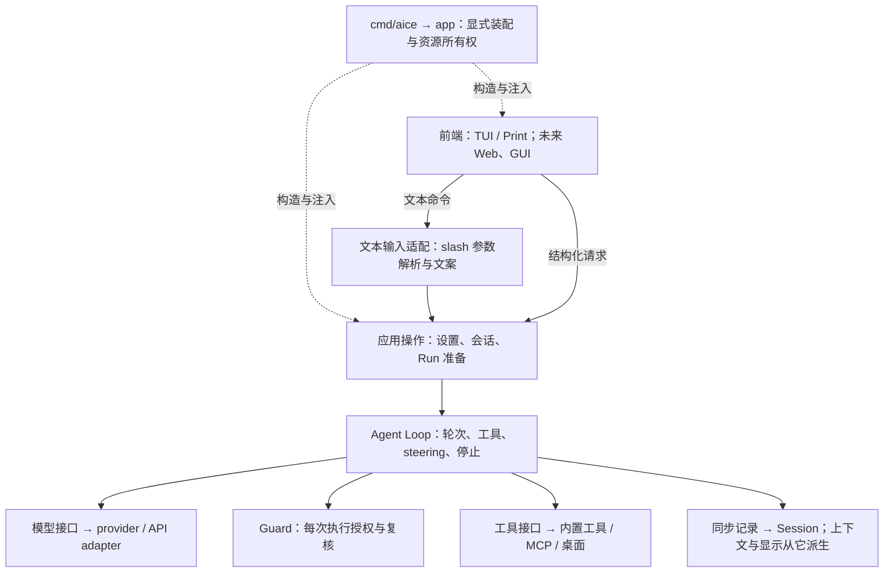

# AICE 架构重构：方向与审阅结论

2026-09-29。用户已确认整体方向、渐进实施与分批提交。初始代码基线为 `ec87012`。
本文保留范围、证据和取舍；当前设计以 [Architecture](../architecture.md)、[Runtime contracts](../contracts.md) 及各领域拥有文档为准。

## 已确认的目标与范围

目标是同一应用运行时支持可替换前端，通过明确边界接入模型与工具；维护者能追踪请求、状态所有者和资源生命周期。运行时是一组应用职责，不要求新建一个名为 runtime 的包。

- 当前只重构并保持已有行为；Web、GUI、Plan、子 Agent、记忆和公开 SDK 均不在本次范围。
- 先审阅和改善主干，再处理 MCP / Computer Use；每个批次都必须有具体问题证据。没有收益的候选停止，不为完成目录清单制造修改。
- 未来 Web/GUI 复用前端无关的运行能力。当前不添加常驻服务、HTTP/RPC、事件总线或第二套运行逻辑。
- 可替换前端不等于多端同时控制。同一会话的 TUI+GUI、只读旁观、不同会话并行是分别需要定义的产品能力，目前均不实现。
- 不以文件长度、字段数量或图中的返回线证明设计有问题。先审事实来源、修改权限和合法状态，再考虑函数、接口和包。
- 行为保持优先；确有契约变化时单独提出，不夹带在结构调整中。

Pi、DeepSeek Harness 和 [Harness 分类文章](https://picrew.github.io/LLM-Harness/) 用于校准问题，不作为 AICE 的行为契约。职责分类不对应固定层数或新包清单。

## 整体方向与当前边界

图中表示职责与主要请求方向，省略结果返回和事件通知；不是 import 图，也不要求所有能力严格逐层调用。装配与运行是两种关系。

Guard 和记录不是可省略的展示订阅。Loop 使用注入的契约，不 import 具体 Guard、工具、TUI 或 Session 实现。框中职责也不都对应独立 Go 包。

| 职责 | 当前所有者与保留边界 |
| --- | --- |
| 视图、草稿、输入与文案 | `tui` / `cli`；`interaction` 提供前端无关契约，slash 是输入适配 |
| 设置变更、Session 选择、Run 准备 | `app`；显式构造和生命周期预约，不增加服务容器 |
| 执行控制 | `agent`；决定轮次、工具、steering、follow-up、重试和停止 |
| 原始历史与派生上下文 | `session` / `conversationState` / compaction；JSONL 是唯一持久化对话来源 |
| 能力实现 | `provider/api`、`tool`、`mcpclient`、`browser`、`desktop`，具体协议与宿主资源留在边界内 |
| 权限 | Trust 决定加载项目输入；Guard 决定工具执行；OS/外部环境提供强隔离 |

非测试 Go 文件的跨平台 import 文本扫描未发现内部包环；`agent` 的内部依赖只有 `llm`。这不是完整调用图，不能据此声称没有运行时耦合。`interaction` 已有 `Runner.NewRun`、`ActiveRun.Run/Deliver` 和 `EventSink`，无需另外构造一套 runtime API。

## 本轮改动与停止决定

| 批次或候选 | 证据与决定 | 结果 |
| --- | --- | --- |
| 工具链与基线 | 本机 Go 1.26.5 低于项目最低 1.26.8 | 通过现有 Homebrew 升到 1.27.1；不修改 go.mod/go.sum |
| 模型设置操作 | Settings 单项选择和 OAuth 登录曾调用 slash handler，业务复用依赖文本命令入口 | 已提取 `selectProvider/selectModel/selectThinking`；三个入口直接调用应用操作 |
| 会话状态收拢 | 核对所有 Store/history/cursor/main-run 写入与锁范围 | 保留现状；初始化、首次建 Store、`/new`、恢复和 compaction 各有原子范围，添加 setter 没有消除调用方的锁知识 |
| 统一 Print/交互 Run | 两条路径已共享 Desktop/MCP 的绑定方法，并按相反顺序清理 | 保留现状；Print 内存/可选 Session 记录与交互历史发布语义不同，统一整个执行器没有已证实收益 |
| 调整包布局 | 未发现现有包妨碍本轮消费者或替换边界的证据 | 不搬包，不新增 runtime/common/services 抽象 |
| MCP 准备期清理 | `bindRun` 的四个错误出口各自承担 catalog 关闭责任 | 收拢到构造成功后的错误返回 defer；成功仍由 Run 关闭，连接仍归 owner |
| Computer Use 状态合并 | 看似重复的状态有不同失效条件和不确定结果语义 | 本轮不改；理由见下，不把审阅结论包装成整个模块已无问题 |

### 模型设置：实际收敛的边界

[model_settings.go](../../internal/app/model_settings.go) 负责校验、准备、保存、一致发布；[settings_apply.go](../../internal/app/settings_apply.go)、模型 slash 适配和账户登录直接复用它。操作只返回调用方需要的启动覆盖信息，不返回命令文案，不新增接口或状态。

保留的契约：

- 外层调用只持有一次设置预约，内部不再申请；锁顺序不变。
- provider 切换可重读 OAuth 凭据、回退模型并重建 Loop；model 一般复用 Loop，只在原有恢复条件下重建；thinking 只更新设置与有效等级。
- requested/effective thinking 是不同事实；`revision/resourceRevision` 也有不同消费者与失效条件。
- 保存失败不发布；已提交但清理告警仍发布并报告；OAuth 凭据先保存、偏好后失败仍保留原部分成功语义。
- 单项选择与批量/unset 设置保持各自原有行为；不顺手统一。

slash 先被处理是因为已有跨入口绕路、影响范围有限且可验证，**不是因为它层级高**。当前边界写入 [Configuration](../configuration.md) 和 [Architecture](../architecture.md)。

### MCP：资源清理归属

[mcp_run.go](../../internal/app/mcp_run.go) 现在统一拥有准备期间的 catalog。错误返回撤销 catalog，正常返回交给 Run；catalog 只持有借用连接，绝不关闭应用 owner 的 transport。

这次减少的是重复清理决策，未证明旧实现泄漏。required 仍只要求 initialize，pinned 还要完成发现；optional 仍惰性；10 秒准备 deadline、错误文本、Guard 和取消语义均不改。状态、连接权限与执行授权仍遵循 [MCP](../mcp.md)。

### Computer Use：必须保留的状态区别

审阅覆盖 app binding、managed catalog、Settings 发布、Manager/Run 生命周期、对应调用方及测试。

| 状态 | 不合并的具体原因 |
| --- | --- |
| managed identity / admission generation | 分别表示应用设置授权代际与原生连接/schema 代际；失效触发不同 |
| Manager runs / occupants | 断线清引用后仍需保留占用，防止恢复期间另一实例抢占 |
| Run closed / cleanupDone | 先取消并拒绝新调用，再等待在途操作；超时后由释放 gate 的调用补清理 |
| Run started / active | start_session 已发出但响应丢失时仍需清理，不能只看是否成功返回 |
| status / client | status 是短锁下投影；最终 dispatch 的 generation 检查不能再次进入持有 client 的 gate |

app 的 binding 冻结能力、取消先于清理且只清理一次；managed catalog 借用 Run；结束先关 catalog，再关 native Run。更改 Settings 与替换 MCP owner 的失败发布语义不同，不能一律合成“全部成功后才撤销”。

也评估了将 backend 与 cleanup 合并进一个接口：生产工厂已固定返回 `run, run.Close`，现有测试需要独立装饰和观测清理；改动将增加 wrapper 和字段，未发现丢清理证据，因此不实施。

未完成全覆盖审计的部分：平台 admission/安装/进程/peer 校验、legacy typed action 与 observe 的全部实现、TUI status/action 的全部并发实现，以及各 OS 真实原生行为。这些是以后有具体问题证据时的调查入口，不是已经批准的重写清单。

## 管理动作的边界与审计结论

Trust 选择保存已移入现有 `project_trust.go` 的具体操作；Settings 与 slash 各自持有一次预约并直接调用。操作不接收命令请求、不返回展示文案，不增加接口或状态。

Browser/Web 管理已收敛到接收动作名称与交互通道的具体操作。Settings 直接调用，slash 适配只投影所需字段；操作不接收命令名称、登录 secret 等其余 `CommandRequest` 字段，没有新增通用 Action 框架。登录本轮补齐两入口行为验证；其专属输入及部分成功失效规则尚未重构。

以下是现状审计，不是要求永久保留的理想状态模型。`revision` 控制设置草稿，`resourceRevision` 控制已准备的 Run 和 BTW 快照。

| 动作结果 | 已发生的事实 | 当前两入口的行为 |
| --- | --- | --- |
| Trust 保存成功 | 修改持久化 Trust；当前加载内容不变 | 均推进草稿版本，不推进资源版本 |
| Trust 保存失败 | 持久化未成功，当前加载内容不变 | Settings 推进草稿版本，slash 不推进 |
| 登录凭据成功、偏好失败 | 凭据已持久化，当前 provider 选择不变 | Settings 推进两个版本，slash 不推进 |
| Web key 成功、偏好失败 | 凭据已保存且缓存更新，已绑定 backend/tools 保留 | Settings 推进两个版本，slash 不推进 |
| Browser 连接完成后取消选 tab，或修改 helper 已启动但结果不确定 | 资源已改变或无法排除改变 | 两入口均推进两个版本，拒绝已准备的 main/BTW Run |
| Browser 输入取消、校验失败且无副作用 | 资源未改变 | 两入口均保留两个版本，已准备的 Run 仍可执行 |
| Web 输入阶段取消且无副作用 | 资源未改变 | Settings 仍推进两个版本，slash 不推进 |
| Web/Browser status | 不保存设置；Browser 可读取 helper 状态 | Settings 仍先申请 shared 预约，slash 可在运行时读取；均不推进版本 |

Browser 试点把准入与收尾分开：准入决定是否要求空闲，收尾分别决定设置草稿与运行资源是否失效；删除生命周期中用于从准入推导失效的 `sharedChange` 状态。操作返回本次资源是否已改变或可能改变，底层 helper 报告进程是否成功启动，连接与后续选 tab 累积各阶段效果。无需新框架、持久状态或自动重试。

Browser 两入口共享这项收尾决定；本领域的两个版本都按资源效果推进。其他领域保留原规则，Trust 仍为重启生效。两入口完成后都会刷新视图，但视图刷新不替代应用层资源失效。Login/Web 的凭据部分提交尚待单独审阅并迁移；详细剩余证据与进入条件集中在 [Maintenance](../maintenance.md#management-action-invalidation-and-partial-completion)。

Web 凭据新增、替换与删除共用一次写入及提交判定：auth 已提交但锁清理失败时，同步内存凭据并单独报告清理告警，继续原偏好流程；真正写入失败不发布、不重放。两入口的故障注入测试先用真实临时 auth 文件复现磁盘与缓存不一致，再验证修复，包含后续偏好失败的部分成功情况。凭据与偏好仍是两次独立提交，详见 [Web](../web.md)。

## 验证与后续进入条件

新增模型选择及 OAuth 部分成功测试，在旧实现（仅覆盖测试文件的 Go overlay）与新实现均通过。MCP 新增 missing-pin/发现中取消测试，同样先在旧实现通过，再验证改动；它们检查失败不关闭 owner 连接、新 Run 复用连接、Run 失效目录和 owner 恰好关闭一次。

每批 Go 改动均执行 `go build ./...`、`go test ./...`、`go vet ./...`、`go test -race ./...`。入口提取另通过实际 CLI/Bubble Tea 的 `TestSettingsUsageTUI` 与 `TestBrowserWindowTUI`；MCP 使用 preparation、Print 和交互连接复用测试。入口提取的管理动作对照测试先在旧实现通过，再验证提取后的行为，覆盖 Trust 的重启生效、账户凭据部分提交、Web 凭据保存后偏好失败，以及 Browser 连接后选 tab 取消。Browser 失效修复另用实际 held main/BTW 执行先复现两入口的错误，再验证无副作用时可执行、有副作用时在模型调用和 Session 消息写入前拒绝；假 helper 日志同时验证修改动作不重放。

证据限于本机 macOS arm64、Go 1.27.1 与默认离线测试。没有做真实付费模型/OAuth 调用、GUI 接入或原生桌面操作；不据此宣布跨平台原生验证通过。Go 模块依赖未改变。

下一批只有同时满足以下条件才进入：能指出真实维护问题及全部调用方；能说明消除了哪项状态、重复决策或绕路；能通过现有契约局部修改并验证行为。P2/P3/CUA 本轮保留决定不等于未来禁止调整，但不为图整齐继续拆分。
