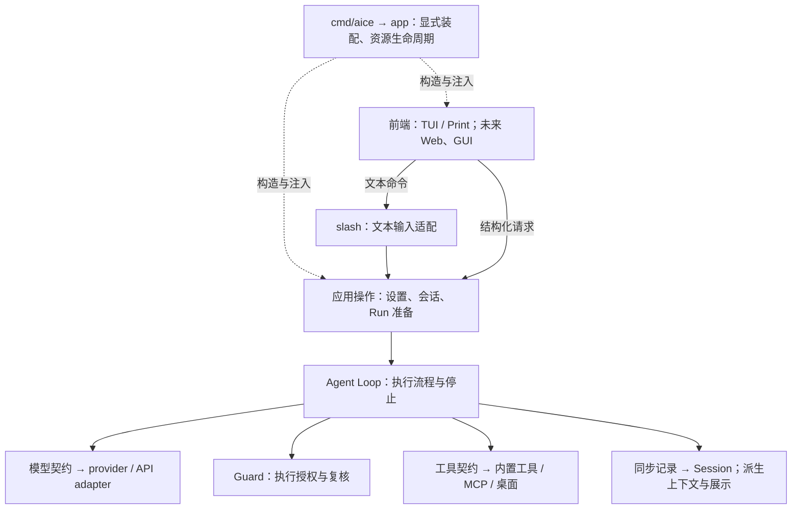

# AICE 架构重构：目标、验收与剩余范围

基线为 `ec87012`。本计划按架构能力验收，不按提交数、修改文件数或修复缺陷数计算进度。
当前设计由 [Architecture](../architecture.md)、[Runtime contracts](../contracts.md) 和各领域文档定义；本文件只维护完成标准、证据入口与下一批范围。

## 目标与范围

目标是同一应用运行时支持可替换前端，通过明确边界接入模型与工具；维护者能追踪请求、找到状态与决策所有者，并局部修改一种行为。

- 当前维护已有功能。新增 Web 前端、GUI、Plan、子 Agent、记忆和公开 SDK 不在重构范围。
- 先完成主干验收，再进入 MCP / Computer Use 专项。已有局部审阅或清理不代表专项完成。
- 前端可替换，不要求增加名为 runtime 的包、常驻服务、HTTP/RPC 或多端同时控制。
- 改动必须消除已证实的绕路、重复决策、隐式依赖或错误状态。文件长、字段多、图有返回线不是问题证据。
- 保持已有契约；已确认的行为修正单独说明其触发条件、前后变化与验证。普通缺陷修复不单独计为架构里程碑。

Pi、DeepSeek Harness 和 [Harness 分类文章](https://picrew.github.io/LLM-Harness/) 用于校准问题，不作为 AICE 的行为契约，也不对应固定层数或新包清单。

## 目标边界

图表示职责与主要请求方向，省略返回与事件通知；装配关系与执行关系分开，不是 import 图。

Loop 不依赖具体前端、工具或 SDK；Guard 与历史记录是执行契约，不是可省略的展示订阅。
现有 `interaction.Runner`、`ActiveRun`、`EventSink` 已提供前端无关边界；此次任务是核实并收敛已有实现，不预先创建另一套运行时 API。

## 完成标准与当前进度

“主干可交接”要求 M1–M3 均完成；“整体重构完成”还要求 M4 完成。每项可以通过有证据的保留决定完成，不要求一定改代码。

| 里程碑 | 完成标准 | 当前证据与状态 |
| --- | --- | --- |
| M0 方向与职责 | 明确装配、执行、历史、前端、能力与权限所有者 | 已确定；见上图及 [Architecture](../architecture.md) |
| M1 应用操作与输入形式分离 | 现有多入口能力直接调用应用操作；输入适配不承担被其他入口复用的业务决策 | 主干范围完成：模型选择、Trust、Browser、Web、登录由应用操作负责，Settings 不再调用 slash handler；TUI 保留交互适配与呈现职责，见[主干验收](../maintenance.md#main-path-acceptance) |
| M2 状态与资源生命周期明确 | 每种修改由发生点报告提交/发布事实；两个入口使用同一领域规则；无效输入、取消、部分提交及清理告警有明确语义，held main/BTW 的可用性符合实际资源状态 | 主干范围完成：修改效果与版本推进对应，Trust 失败可复用草稿、成功仍只在重启后生效；Web 启动早退与替换后的清理已补齐。MCP/CUA 内部状态归入 M4 |
| M3 主干全链路验收 | 从现有前端无关边界追踪输入、Loop、工具/审批、Session、取消和关闭；逐项链接已有测试、补真实缺口，明确哪些路径共享、哪些差异必须保留 | 当前 TUI / Print 主干可交接：输入、执行、审批、记录、压缩、取消与关闭已有逐项证据和保留决定，见[主干验收](../maintenance.md#main-path-acceptance)；不等于未来 GUI/多前端或所有外部能力已验收 |
| M4 MCP / Computer Use 专项 | 主干验收后，分别核实接入边界、状态归属、授权与连接/Run 生命周期；只重构已证明影响局部维护的耦合，并明确原生平台验证范围 | 主体未开始：MCP 准备期目录清理已收拢，部分 CUA 状态已审阅；不足以认定模块整体完成 |

不报缺乏分母的完成百分比。每轮报告本轮关闭了哪个验收缺口、还有哪些缺口，以及是否发现必须重新讨论的契约。

## 接下来的实施顺序

| 批次 | 唯一主线 | 验收与停止点 |
| --- | --- | --- |
| M4-A：MCP 所有权与生命周期（下一批） | 先追踪配置→连接 owner→Run catalog→Guard→调用→失效/关闭，明确借用与拥有关系 | 先列出现有状态及修改者、已有测试与真实缺口；选一个已证明的局部问题实施。若边界已足够，明确保留，不预设拆包或新管理器 |
| M4-B：Computer Use 专项 | 在 MCP 接入边界基础上审 native Manager/Run、权限、窗口身份与清理 | 区分应用接入和原生平台事实；逐项决定修正、保留或待验证，不以离线测试替代原生执行证据 |

实现前读完整操作、调用方和测试，先写出“发生了什么、谁拥有它、哪些消费者会受影响”。不先定义通用 Action/事务框架，再让不同领域填字段。只有重复的具体需求和语义已经证明一致，才考虑进一步复用。

新发现的问题先判断是否阻塞当前验收。直接阻塞边界正确性的问题可单独修复并验证；无关缺陷记录到拥有文档或维护清单，避免每轮沿旁支扩大范围。修复数量不增加里程碑进度。

## 已有证据与保留决定

这些结论限定于实际审阅范围，不表示整个模块不存在问题。

| 路径 | 已确认的边界或保留理由 | 证据入口 |
| --- | --- | --- |
| 模型设置 | provider/model/thinking 的准备、保存与发布由具体应用操作拥有；requested/effective thinking 是不同事实 | [model_settings.go](../../internal/app/model_settings.go)、[Configuration](../configuration.md) |
| Browser 管理 | 操作报告本地改变或可能发生的远端效果；准入与收尾分开，草稿与资源版本独立；没有副作用的失败不使 Run 失效 | [browser.go](../../internal/app/browser.go)、[Browser](../browser.md)、[held Run 测试](../../internal/app/browser_invalidation_test.go) |
| Web 管理 | 操作报告持久提交与资源发布，两入口共享收尾；仅凭据提交不替换旧 backend，也不使 held Run 失效 | [web_commands.go](../../internal/app/web_commands.go)、[Web](../web.md)、[held Run 测试](../../internal/app/web_invalidation_test.go) |
| 登录操作 | 两入口共享完成协调；API key 客户端保留创建时凭据，OAuth 每次请求读取磁盘，因此凭据单独提交的资源效果不同 | [auth_login.go](../../internal/app/auth_login.go)、[Configuration](../configuration.md#credentials-and-connection-overrides)、[held Run 测试](../../internal/app/auth_invalidation_test.go)、[凭据提交测试](../../internal/config/oauth_cleanup_test.go) |
| Trust 管理 | 失败没有持久提交，不需要制造过期草稿；成功仍不改变当前加载的项目上下文 | [project_trust.go](../../internal/app/project_trust.go)、[重试测试](../../internal/app/project_trust_selection_test.go)、[Project Trust](../project-trust.md) |
| Web 资源退出 | 应用退出关闭当前拥有的 backend；初始化早退也必须清理，更换时旧 owner 只关闭一次 | [app.go](../../internal/app/app.go)、[退出测试](../../internal/app/web_lifecycle_test.go) |
| 会话状态 | 初始化、首次创建 Store、new、恢复与 compaction 各有原子范围；只添加 setter 不能消除调用方的锁知识 | [Runtime contracts](../contracts.md)、[Maintenance 请求路径](../maintenance.md#follow-one-interactive-request) |
| Print / 交互执行 | 已共享 Desktop/MCP 绑定；内存/可选记录与交互历史发布语义不同，尚无统一整个执行器的证据 | [app.go](../../internal/app/app.go)、[Runtime contracts](../contracts.md) |
| 包布局 | 现有 import 扫描未发现内部包环，Agent 的内部依赖只有 llm；这不能证明不存在运行时耦合 | [Architecture](../architecture.md#package-map) |
| MCP 清理 | 准备失败由 bindRun 统一关闭 catalog；成功交给 Run；借用连接仍归 owner | [mcp_run.go](../../internal/app/mcp_run.go)、[MCP](../mcp.md) |
| Computer Use 状态 | identity/generation、占用/连接、关闭/清理完成、已启动/已确认活动有不同失效条件，不能仅因字段相似而合并 | [Computer Use](../desktop.md)、[Runtime contracts](../contracts.md) |

主干收口以边界验收为依据。局部正确性修复不单列为架构阶段；不因还有 MCP/CUA 专项或原生平台验证，就继续扩大主干抽象。

## 验证与交付

遵循 [Collaboration](../collaboration.md)：局部复现或行为基线 → 最小改动 → 聚焦验证 → 必要全量检查 → 独立提交，并同步领域拥有文档。
涉及共享状态、取消或生命周期时包含 race；用户入口包含实际 CLI/Bubble Tea 路径。验证 main/BTW 时检查实际执行、模型调用与历史写入，避免只证明计数器变化。

现有本地证据来自 macOS arm64、Go 1.27.1；真实浏览器、付费模型/OAuth、原生桌面及其他平台的验证不能由离线用例代替。跨平台或外部系统限制明确列出；不以这些尚未验证的结果宣称完成。
