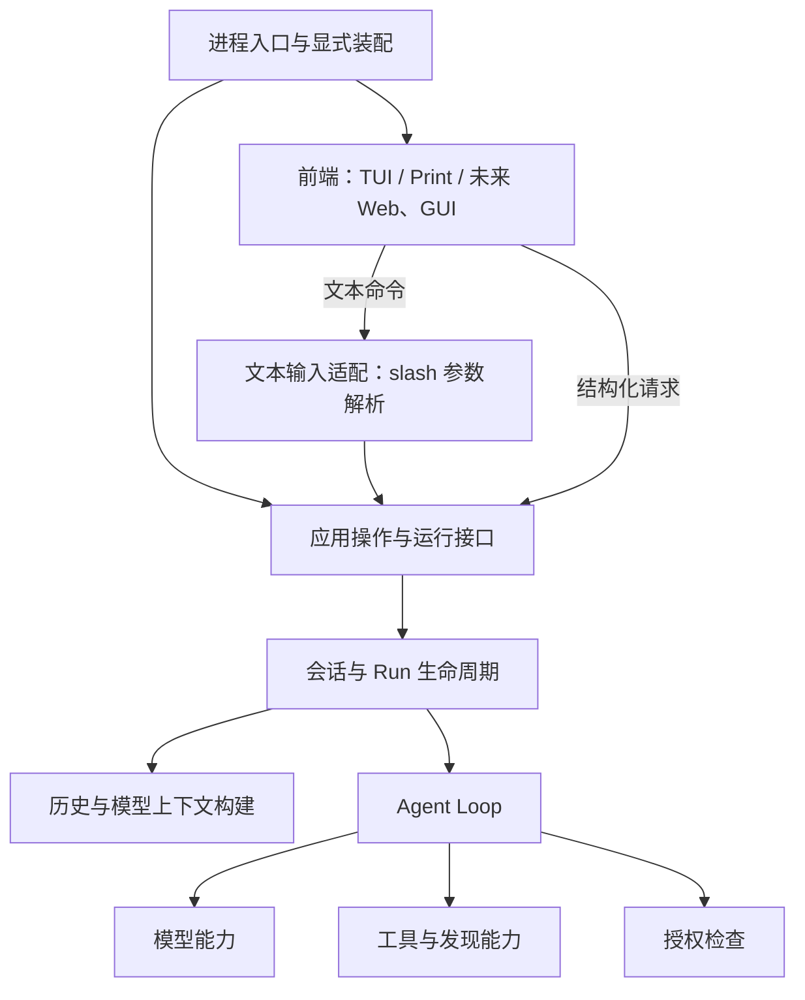

# AICE 架构重构：共同设计草案

状态：整体方向、先小范围验证的 P1 路线及 MCP/Computer Use 后置顺序已由用户确认；逐步细化实施设计。代码核对基线：`ec87012`，2026-09-29。
本文记录方向、证据与候选步骤，不替代当前 [Architecture](../architecture.md) 和运行契约。
尚未修改 Go 代码；已升级本地工具链，默认测试基线已通过。

## 1. 已确认的目标与范围

用户已明确：整体方向与渐进实施都需要；遵守“代码宪法”，先证明问题，关注数据模型、唯一权威来源与决策归属；少即是多；MCP 和 Computer Use 内部重构可以后置。

整体目标：同一个应用运行时支持可替换的前端，通过明确边界接入模型与工具；状态所有权、生命周期和执行过程可以追踪。这里的运行时是一组应用职责，不预先要求新建一个名为 runtime 的包。

2026-09-29 用户确认的范围：

- 当前唯一目标是重构，期间维护现有功能；不新增 Web、GUI、Plan、子 Agent 或记忆。
- 先完成主干重构，再进行 MCP / Computer Use 内部重构；新增功能在这两个阶段之后考虑。
- 未来可能先提供可启动网页的 Web 模式，再提供 GUI。它们应复用独立于表现层的运行时；当前不因此引入常驻服务、HTTP/RPC 或第二套运行逻辑。
- 公开 SDK 短期不在计划内。多个前端同时连接同一运行时包括 TUI+GUI、TUI+Web 或多个网页客户端；同一会话的多端控制、只读旁观、不同会话独立执行还需分别定义。这是不同于可替换前端的产品能力，目前不纳入重构验收，也未确定并发控制和旁观策略。
- 动态第三方插件目前没有明确需求；优先采用已有 Go 接口和显式装配，不将外部项目的插件体系直接移植。

Pi、DeepSeek Harness 和分类文章用于校准设计问题，不作为 AICE 行为契约：
[Pi](https://github.com/earendil-works/pi)、[DeepSeek Harness](https://github.com/deepseek-ai/deepseek-harness)、[Harness 分类](https://picrew.github.io/LLM-Harness/)。
分类维度用于检查职责覆盖，不对应七层顺序调用或七个新包。

## 2. 当前结构：已核对事实

以下区分代码事实、工程判断和仍待调查的问题。测试文件的存在与内容不等于本轮执行通过。

| 编号 | 事实与证据 | 判断 |
| --- | --- | --- |
| F1 | 对 `internal` 非测试 Go 源码进行 import 文本扫描，包含所有平台文件，未发现内部包环；`agent` 的内部依赖只有 `llm` | 保留 Loop 隔离。此扫描不是编译或语义调用图，不能据此宣布没有运行时耦合 |
| F2 | [interaction/contracts.go](../../internal/interaction/contracts.go) 已定义 `Runner.NewRun`、`ActiveRun.Run/Deliver`、`EventSink`；[tui/run.go](../../internal/tui/run.go) 通过这些接口驱动运行 | 前端边界已有基础，没必要并行新造一组运行接口 |
| F3 | 同一契约文件的 `CommandRunner` 暴露 `SlashCommands/RunSlashCommand`；[settings_apply.go](../../internal/app/settings_apply.go) 为单项 provider/model/thinking 设置构造 `CommandRequest` 并调用 slash handler，丢弃返回文案 | 已证实应用操作复用需要经过文本命令处理函数。是结构改进候选，不是已证明的用户故障 |
| F4 | [interactive_commands.go](../../internal/app/interactive_commands.go) 的三个 handler 同时包含参数解析、业务校验、保存、状态发布和文案；[auth_interactive.go](../../internal/app/auth_interactive.go) 与 [auth_claude_interactive.go](../../internal/app/auth_claude_interactive.go) 登录后也调用 `slashProvider` | 提取应用操作能服务实际已有消费者。provider 影响面大于 thinking，不宜把三者视为完全相同的算法 |
| F5 | 同文件的 `RuntimeState()` 返回 `sessionChanged/transcript` 后清空它们；[interaction/contracts.go](../../internal/interaction/contracts.go) 明确 Transcript 是一次性交付 | 当前是含消费行为的读取，不是可任意重复读取的广播快照。单前端适用；多前端支持不能仅靠再接一个 UI |
| F6 | [app.go](../../internal/app/app.go) 的 Print 与 [interactive_run.go](../../internal/app/interactive_run.go) 都按桌面 Run、MCP Run、结果读取能力的顺序绑定；通过 defer 先关 MCP Run 再关桌面 Run | 相似生命周期可调查。两条路径已复用绑定方法，不能仅凭相似代码认定需要统一整个执行函数 |
| F7 | [conversation.go](../../internal/app/conversation.go) 已拥有 Store、派生历史、主 Run 的待处理消息及发布锁；[app.go](../../internal/app/app.go) 的 `interactiveSession` 还组合配置、模型、工具、管理资源与前端交互状态 | 先沿现有所有者缩小访问面。字段多不是缺陷证据，不预设拆掉整个会话对象 |

### 需要保留的实际差异

- requested thinking 与 effective thinking 是不同事实。[interactive_commands_test.go](../../internal/app/interactive_commands_test.go) 的 `TestInteractiveSessionThinkingKeepsRequestedLevelAndClampsPerModel` 验证切换模型后恢复原请求；不能合并成一个字段。
- provider 切换会重新构建模型服务，并可能重读 OAuth 凭证；model 切换通常复用 Loop，仅在特定恢复条件下重建；thinking 修改只更新对应配置与选项。不要为了共享代码把它们统一成每次都重建。
- [settings_lifecycle.go](../../internal/app/settings_lifecycle.go) 的 `revision` 和 `resourceRevision` 区分设置草稿与运行资源有效性；不能因为都是版本号而合并。
- 同步 `MessageRecorder` 是后续副作用前的记录边界，定义在 [agent/contracts.go](../../internal/agent/contracts.go)。不能替换成不等待的展示事件订阅。
- Print 可以把结果保存在当前调用的内存源，也可以写 Session；交互会话通过 conversation 发布可恢复的历史。共享资源准备不等于统一记录语义。
- Guard 的授权、最终校验、撤销，以及桌面动作的未知结果，是必须保留的契约，不以减少分支为由删除。

## 3. 建议目标结构

下图表达职责和主要调用关系，不是已实现结构、import 图或新包清单。依赖通过明确契约传入；结果与事件返回线省略。



装配负责选择具体实现，运行路径不从全局注册表查找依赖。图中的前端输入适配允许某个 GUI 直接调用结构化操作；不要求所有输入通过 slash。

| 职责 | 所有权目标 | 当前起点 |
| --- | --- | --- |
| 表现与输入 | 视图、草稿、格式化、输入解析；不拥有执行和持久化决策 | tui、cli、interaction |
| 应用协调 | 设置操作、会话选择、Run 准备与资源变更 | app 现有操作与 lifecycle |
| 执行控制 | 模型轮次、工具调用、steering、follow-up、重试与停止 | agent |
| 会话与上下文 | 原始事实、分支和上下文派生；定义发布时机 | session、conversation、compact |
| 能力实现 | 模型协议、内置工具、MCP、浏览器和桌面；各自持有具体资源 | provider/api、tool、mcpclient、browser、desktop |
| 横向约束与证据 | 授权、执行记录、用量、验证；明确哪些检查阻塞执行 | guard、现有记录/事件/usage、测试与验收设施 |

验收目标是换入口或增加普通工具时修改局部，而不是要求所有新功能都无需修改 Loop。改变执行语义的功能需要重新审查控制契约。

## 4. 迁移候选与顺序

整体顺序与 P1 小范围验证方向已确认。后续条目仍须取得具体问题证据，不是所有行都必须实施的施工单。

| 步骤 | 目标 | 进入条件 | 完成或停止条件 |
| --- | --- | --- | --- |
| P0 | 建立行为与工具链基线 | 产品范围已确定 | 明确已有契约、测试范围和首个候选；没有问题的模块留在原处 |
| P1 | 分离模型选择的应用操作与 slash 适配 | F3/F4 已证实，先补齐两入口的行为对照 | Settings 不经过 slash handler；命令保留原解析和文案；没有新增状态、服务容器或权限路径 |
| P2 | 核对会话状态所有权，逐个收拢越界写入 | 找到具体字段的全部写入者和真实维护问题 | 一个事实的修改归属清楚；保留有来源和失效规则的派生视图；不以字段数量立项 |
| P3 | 改善 Run 资源准备和清理 | 两入口差异审计发现漏项、真实重复决策或明显维护成本 | 共享适合共享的局部准备；失败与取消清理明确；Print/交互记录语义保留；若现有复用足够则不改 |
| P4 | 根据已形成的边界调整包/API | 存在独立消费者、测试需求或依赖限制，当前包确实妨碍边界 | 包迁移与行为变更分开；没有新旧两套永久接口；不是为了图整齐搬文件 |
| 第二阶段 | MCP / Computer Use 内部治理 | 主干重构完成，重新审计具体问题 | 依同一原则渐进重构；主干阶段只处理妨碍运行时边界的接入问题 |

P2/P3 可以根据证据交换；不先承诺大范围统一。前端替换能力通过现有契约和无界面测试验证，不以开发新 GUI 为前置条件。

### 为什么从命令相关路径开始

slash 的架构位置只是文本输入适配。迁移先后顺序表示修改的证据充分度、影响范围和验证成本，不表示架构层级或重要程度。
P1 的对象是模型设置应用操作，slash 只是现有调用方之一：Settings、文本命令和登录流程已经需要同一操作，不涉及为未来入口预建框架。
先以较小的 thinking 路径验证方法，再处理 model/provider；不因此扩张成全部命令系统重写。

## 5. 第一候选的细化：模型设置操作

建议从 thinking 开始验证提取方法，再按同一边界处理 model 和 provider；每步保持可运行。若独立步骤只增加转发且没有移除入口依赖，则合并成一个小的模型设置改动。

### 当前路径

```text
Settings -> ApplySettings -> 预留设置操作 -> slash handler
slash -> RunSlashCommand -> 预留设置操作 -> slash handler
OAuth 登录 -> 已持有操作预留 -> slashProvider
```

### 目标路径

```text
Settings -> 校验设置载荷 -> 共享应用操作
slash -> 解析命令参数 -> 共享应用操作 -> 命令文案
OAuth 登录 -> 保存凭证 -> 共享 provider 操作
```

- 操作先保留为 app 包内具体函数/方法，无需增加只有一个实现的接口。
- 共享操作接收已解析的 provider/model/thinking 值，不接收命令名和菜单状态，不返回 slash 文案。
- 共享操作负责已有的业务校验、准备、保存和一致发布；保持三类操作当前不同的构建策略。
- 操作预留仍由最外层调用持有一次；内部操作不重复申请，不改锁顺序。
- 保留现有单项选择与批量/unset 设置路径；它们是否应统一需要另行核对语义，不能顺手合并。
- 保留 `persistSettings` 对“已提交但锁清理告警”的处理，以及 requested/effective thinking 区别。
- 精确返回类型在完整核对调用方后确定，只携带消费者实际需要的信息，不预建通用 CommandResult 或事务框架。

### 必须验证的场景

| 场景 | 必须保持的行为 | 现有证据起点 |
| --- | --- | --- |
| 单项 thinking 修改 | 两入口保持配置、实际等级和保存结果一致；各自展示方式不变 | settings_apply、slashThinking、配置命令测试 |
| 无效值 | 不持久化、不发布状态 | `TestInteractiveSessionConfigurationCommandsRejectUnsupportedValues` |
| 切换模型 | 保留原 thinking 请求，只派生实际等级 | `TestInteractiveSessionThinkingKeepsRequestedLevelAndClampsPerModel` |
| 保存/准备失败 | 不提前发布新配置或模型 | [settings_test.go](../../internal/app/settings_test.go)、[app_model_recovery_test.go](../../internal/app/app_model_recovery_test.go) |
| 修改与 Run 准备重叠 | 正确返回 busy/stale；旧 Run 不接受消息 | settings_test.go 的保存阻塞与旧版本测试 |
| 已落盘但清理告警 | 不谎报未保存；版本、运行状态和告警保持原语义 | persistSettings、config.WasCommitted 及调用方测试，实施前补齐对照 |
| provider 与登录 | 保留模型回退、凭证部分成功和 Guard 复用 | interactive_commands_test.go、auth_* 与相关测试，provider 步骤前完整审查 |

已有测试不等于完整覆盖。先核对并补必要缺口，再提取操作。验收不仅是新增函数存在，而是旧的跨入口调用被移除且行为基线保持。

## 6. 验证与决策记录

已做：源码/调用点静态审查、读取相关测试、静态 import 扫描、检查工作区。没有进行 GUI 接入或原生桌面验证。

用户授权后沿用现有 Homebrew 将本机 Go 从 1.26.5 升级到稳定版 1.27.1；`go version` 和 `GOTOOLCHAIN=local go version` 均确认 1.27.1 darwin/arm64，满足项目最低版本 1.26.8。未修改 go.mod/go.sum。PATH 未发现 gopls，尚未安装。

`go test ./...` 首次在沙箱内因 macOS 构建缓存访问限制而未能启动测试，随后取得缓存访问权限重新运行，所有默认测试通过，退出码 0（Go 1.27.1，macOS arm64）。这是本机默认测试基线，不代表 race、其他平台或显式原生/真实模型验收通过。

Go 修改按 [Collaboration](../collaboration.md) 执行格式化、全量 test/vet 及适用的 lint；涉及并发/取消/共享状态时运行 race；用户入口变化还需实际 CLI/TUI 验证。当前文档变更只检查格式、链接和事实。

每一步完成后记录：删除了什么绕路/重复决策/状态，保留了什么契约，实际验证了什么。收益不足的候选撤销；实现落地后将接受的边界写入对应拥有文档，清理本草案的过渡内容。

已确认：整体职责方向、P1 先小范围验证、主干完成后重构 MCP/Computer Use、新功能后置。接下来完成可运行基线和 P1 的最小实现；P2/P3 的具体对象依证据选择。代码实现尚未开始。
