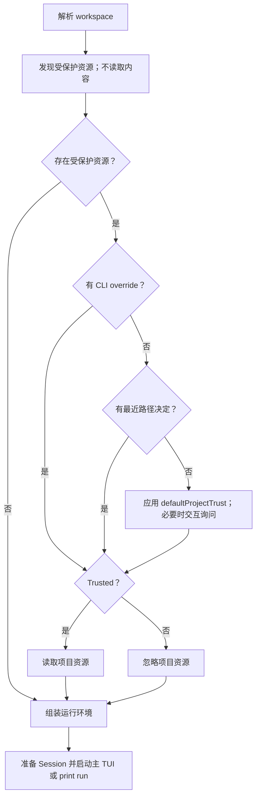

# Project Trust 实现计划

## 目标

为 AICE 增加 Pi 风格的 Project Trust 与受保护的系统 Prompt：在读取受项目控制的启动资源前，先根据命令行覆盖、已保存决定、全局默认策略和交互选择解析当前工作目录是否可信。可信时读取 `.aice/SYSTEM.md`（替换基础 Prompt）与 `.aice/APPEND_SYSTEM.md`（追加）；不可信时忽略它们。

Project Trust 只控制项目资源加载，不改变内建工具、宿主进程、文件系统、网络或凭据权限。`--workspace` 继续只是工具的默认工作目录，不是沙箱或访问白名单。

## Pi 语义核对

本计划以 2026-08-04 的 Pi 官方文档和源码为语义参考：

- [Security](https://github.com/earendil-works/pi/blob/main/packages/coding-agent/docs/security.md)
- [Settings](https://github.com/earendil-works/pi/blob/main/packages/coding-agent/docs/settings.md#project-trust)
- [trust-manager.ts](https://github.com/earendil-works/pi/blob/main/packages/coding-agent/src/core/trust-manager.ts)
- [project-trust.ts](https://github.com/earendil-works/pi/blob/main/packages/coding-agent/src/core/project-trust.ts)

Pi 的当前行为是：

- 只有发现需要信任的项目资源时才解析 Project Trust。裸 `.pi` 目录不会触发。
- 受保护资源包括当前工作目录下的 `.pi/settings.json`、扩展、Skill、Prompt 模板、Theme、System Prompt 文件，以及当前目录或祖先目录中的项目级 `.agents/skills`。
- `defaultProjectTrust` 是全局设置，值为 `ask`、`always` 或 `never`，默认 `ask`。
- 已保存决定以规范化目录路径存储在 `~/.pi/agent/trust.json`，查询时使用当前目录或其最近祖先的决定。
- `-p`、JSON 和 RPC 等非交互模式不弹窗；没有可用决定时，`ask` 与 `never` 都按不信任处理，`always` 按信任处理。
- `--approve` 和 `--no-approve` 只覆盖本次运行，不持久化。
- `AGENTS.md` 和 `CLAUDE.md` 上下文文件不受 Project Trust 控制，除非关闭上下文加载，否则无论项目是否可信都会加载。
- Project Trust 是 input-loading guard，不是沙箱；Pi 工具和扩展仍以 Pi 进程权限运行。

因此，以下概括主体正确，但需要两处修正：

1. 触发路径应写成“当前目录或祖先目录中的项目级 `.agents/skills`”，不是 `project.agents/skills`。
2. AICE 当前没有项目级启动配置、上下文、Skill 或扩展加载，但会显式读取或创建 `.aice/sessions/*.jsonl`。Session 是用户选择或 AICE 创建的持久化会话，不是 Project Trust 保护的项目启动资源。

## AICE 当前基线

当前实现具有以下相关行为：

- `internal/app` 在 `Print` 和 `Interactive` 中直接调用 `newRunEnvironment`，依次解析 workspace、加载全局配置、创建内建工具并组装 Agent Loop。
- `defaultSystemPrompt` 是编译期常量，没有项目级 System Prompt 加载。
- `internal/config` 只读取环境变量、`~/.aice/settings.json` 和 `~/.aice/auth.json`。Provider、model 和 thinking 明确禁止从项目设置读取。
- 交互模式在 `<workspace>/.aice/sessions/` 创建 append-only JSONL Session；恢复 Session 时要求 header 中的 working directory 与当前 workspace 一致。
- `tool.Workspace` 使用绝对、清理后的路径作为默认工作目录，但允许绝对路径和 `..`；它不是访问边界。
- `bash` 直接在宿主环境执行，`read`、`write`、`edit` 等工具没有内建审批。
- TUI 已有 Bubble Tea 生命周期和菜单组件，但主 TUI 启动时 Agent 运行环境已经组装完成，不能用主界面中的 Slash Command 菜单解决启动前 Trust。

这意味着 AICE 目前没有可被 Project Trust 拒绝加载的资源。只增加“是否信任目录”弹窗会成为没有安全效果的提示。Project Trust 必须与首个受保护资源在同一个功能变更中交付。

## 核心产品决策

### Trust 控制什么

MVP 保护两个项目资源：

```text
<workspace>/.aice/SYSTEM.md
<workspace>/.aice/APPEND_SYSTEM.md
```

可信时，AICE 用 `.aice/SYSTEM.md` 替换 `defaultSystemPrompt`，并在其后追加 `.aice/APPEND_SYSTEM.md`；不可信时完全忽略这两个文件。选择它们作为首批资源的原因是：

- 能立即证明 Trust 确实控制了输入加载。
- 不需要提前建设 Skill、扩展、包管理或插件框架。
- 全局 `~/.aice/SYSTEM.md` 与 `~/.aice/APPEND_SYSTEM.md` 是用户自有文件，始终可信，Pi 语义。
- 产品决策：明确允许项目 SYSTEM.md 替换 AICE 的基础 System Prompt。
- 不违反 provider、model 和 thinking 只能来自全局配置的现有不变量。

后续功能只有在真正实现对应加载器时，才加入 Trust 触发集合：

| 资源 | MVP | 加入触发集合的条件 |
| --- | --- | --- |
| `.aice/APPEND_SYSTEM.md` | 是 | 与 Project Trust 同时实现 |
| `.aice/SYSTEM.md` | 是 | 产品决策允许项目替换基础 System Prompt |
| `.aice/settings.json` | 否 | 只定义项目资源设置，且不包含 provider、model、thinking 或凭据后 |
| `.aice/skills` | 否 | Skill 发现与加载合同稳定后 |
| `.agents/skills` | 否 | AICE 支持 Agent Skills 后 |
| `.aice/prompts`、`.aice/themes` | 否 | 对应 TUI/Prompt 功能存在后 |
| `.aice/extensions`、项目包 | 否 | 扩展合同和分发模型稳定后 |

下列内容永远不作为 Project Trust 触发条件：

- 裸 `.aice` 目录。
- `.aice/sessions` 及其中的 JSONL Session。
- 普通源码、README、构建输出和工具读取到的文件。
- 全局 `~/.aice` 配置、凭据和未来全局资源。
- 通过显式 CLI 参数指定的用户资源；显式参数由调用者负责。

### Trust 不控制什么

Project Trust 不得：

- 禁用、替换或包装 Agent Loop 中的工具执行。
- 将 `tool.Workspace` 改造成目录白名单。
- 限制绝对路径、`..`、网络、环境变量或进程权限。
- 为 `bash`、`write`、`edit` 增加逐次审批。
- 被描述成 Sandbox、安全执行模式或 Prompt Injection 防护。
- 改写 Session 历史或把决定写进 Session JSONL。

当项目不可信时，AICE 仍然可以由模型读取仓库内容并调用宿主工具。真正隔离仍由未来明确选择的容器、VM、OS Sandbox 或执行环境负责。

### Context 文件的未来语义

为保持 Pi 语义，未来支持 `AGENTS.md` 或 `CLAUDE.md` 时，默认不把它们纳入 Project Trust。它们是上下文输入，不是受保护的可执行项目资源。文档必须同时说明：这种兼容行为不消除 Prompt Injection 风险。

如果未来要采用比 Pi 更严格的策略，让 Context 文件也受 Trust 控制，应作为独立产品决策修改本计划和 `AGENTS.md`，不能在实现中顺带改变。

### System Prompt 组装

按 Pi 的 `discoverSystemPromptFile` / `discoverAppendSystemPromptFile` 语义：

```
base:
  1. .aice/SYSTEM.md          ← trusted 且存在
  2. ~/.aice/SYSTEM.md        ← 存在
  3. defaultSystemPrompt      ← 内建常量
append:
  1. .aice/APPEND_SYSTEM.md   ← trusted 且存在
  2. ~/.aice/APPEND_SYSTEM.md
组装:
  base + "\n\n" + "Project instructions from <path>:\n" + append
```

- 项目文件只读一个，不可信时完全跳过项目层，全局层仍生效。
- 空白 `APPEND_SYSTEM.md` 等价于无追加；空白 `SYSTEM.md` 回落到下一级 base。
- compaction 请求始终使用固定 `compactionSystemPrompt`，绝不包含项目 Prompt。
- 项目文件通过 `os.Root` 限制读取，必须是普通 UTF-8 文件且 ≤ 64 KiB，否则 fail-closed。

### Pi → Go 命名映射

| Pi (TypeScript) | AICE (Go) |
| --- | --- |
| `ProjectTrustDecision` (boolean\|null) | `trust.Decision`（三态 uint8，零值 unknown） |
| `DefaultProjectTrust` | `config.Settings.DefaultProjectTrust trust.Default` |
| `ProjectTrustStore` (`get`/`set`/`setMany`) | `trust.Store` (`Lookup`/`Set`/`SetMany`) |
| `ProjectTrustStoreEntry` | `trust.Entry` |
| `ProjectTrustUpdate` | `trust.Update`（DecisionUnknown 删除 key） |
| `ProjectTrustOption` | `trust.Choice` |
| `getProjectTrustOptions` | `trust.Choices(cwd)` |
| `getProjectTrustParentPath` | `trust.ParentPath` |
| `hasTrustRequiringProjectResources` | `trust.Discover` → `Snapshot` |
| `resolveProjectTrusted` | `trust.Store.Resolve`（纯逻辑，不导入 Cobra/Bubble Tea/Agent） |
| `CONFIG_DIR_NAME` (`.pi`) | 硬编码 `.aice`（AICE 即产品名） |

## 威胁模型

### 受保护的边界

攻击者可以控制仓库中的 `.aice/APPEND_SYSTEM.md`，未来还可能控制项目设置、Skill、扩展和包声明。Project Trust 防止 AICE 在用户未决定前自动读取这些直接改变启动行为的资源。

### 不在边界内

Project Trust 不防止：

- 用户信任项目后，受保护资源影响模型行为。
- 模型从源码、文档、注释、测试输出或命令输出中受到 Prompt Injection。
- 模型调用拥有宿主权限的内建工具。
- 用户通过 CLI 显式加载不可信文件。
- 受信任父目录中的恶意子项目继承父目录决定。

“Trust parent folder” 必须显示将被保存的完整父目录，因为它扩大了后续自动信任范围。

### Fail-closed 行为

- Trust store 无法读取、无法解码或包含非法值时，启动失败并报告文件路径，不得自动信任。
- 受保护项目资源无法安全读取时，可信项目启动失败并报告资源路径，不得静默使用部分内容。
- 非交互模式遇到 `ask` 时按不信任处理，不得等待 stdin 或启动 Bubble Tea。
- 交互询问被取消时按“本次 Session 不信任”处理，不持久化。

## 最终用户行为

### 解析优先级

每次启动按以下顺序解析：

1. 规范化并验证 workspace。
2. 只发现受保护资源的存在和类型，不读取内容。
3. 若没有受保护资源，直接视为可继续启动，不查询 store、不弹窗。
4. 若设置了 `--approve` 或 `--no-approve`，使用本次运行覆盖值。
5. 查询 `~/.aice/trust.json` 中当前目录或最近祖先的已保存决定。
6. 使用全局 `defaultProjectTrust`：
   - `always`：信任。
   - `never`：不信任。
   - `ask` 且交互 UI 可用：显示询问。
   - `ask` 且无交互 UI：不信任。
7. 可信时读取发现阶段得到的资源快照；不可信时忽略这些资源。
8. 使用解析后的 System Prompt 组装 Agent Loop、Session 和主 TUI。



### 交互选择

启动询问提供：

1. `Trust`：保存当前规范化目录为可信。
2. `Trust parent folder (<path>)`：保存直接父目录为可信，并删除当前目录的显式覆盖。
3. `Trust this session only`：本次运行可信，不写 store。
4. `Do not trust`：保存当前目录为不可信。
5. `Do not trust this session only`：本次运行不可信，不写 store。

提示文案必须准确说明授权内容，例如：

```text
Trust project folder?
<canonical-workspace>

This allows AICE to load project-local prompts and future protected
resources. It does not sandbox tools or restrict filesystem access.
```

主 TUI 启动后的 `/trust` 使用相同选项修改未来启动决定。保存后不热加载项目资源，并提示重新启动 AICE。

### 非交互模式

MVP 只有 `--print`，规则是：

- 永不启动 Trust TUI。
- `--approve`：本次运行加载受保护资源。
- `--no-approve`：本次运行忽略受保护资源。
- 无 CLI 覆盖：使用最近已保存决定，然后使用 `defaultProjectTrust`。
- `defaultProjectTrust: ask` 与 `never` 都忽略受保护资源。
- 不信任不是命令错误；AICE 使用全局配置和默认 System Prompt 继续执行。

未来增加 JSON/RPC 模式时复用相同 resolver，不能复制一套不同逻辑。

## 持久化设计

### 全局设置

在 `~/.aice/settings.json` 增加全局字段：

```json
{
  "defaultProjectTrust": "ask"
}
```

值只能是 `ask`、`always` 或 `never`。默认值为 `ask`。该字段没有项目级覆盖；MVP 不增加环境变量，CI 使用显式 CLI flag，避免环境中一个宽泛的 `always` 无意信任所有仓库。

### Trust store

使用独立的 `~/.aice/trust.json`，不与模型设置或凭据混写：

```json
{
  "version": 1,
  "projects": {
    "/canonical/work": true,
    "/canonical/work/untrusted-repo": false
  }
}
```

磁盘格式只保存 `true` 或 `false`；缺少 key 表示未知。内存中的决定使用三态类型，零值必须是 unknown。

写入要求：

- `~/.aice` 使用 `0700`，trust 文件使用 `0600`。
- 严格 JSON 解码并拒绝未知字段、多值和非布尔决定。
- 对整个 read-modify-write 持有跨进程文件锁。
- 在同一目录写临时文件，`Sync`、关闭后原子 `Rename`。
- 不引入新的直接依赖。优先用按平台拆分的标准库锁实现；如果实现阶段确认无法满足支持平台，应先说明维护与许可证情况并请求依赖批准，不能退化为无锁写入。

### 路径规范化

Trust key 与工具 workspace path 是两个不同语义：

- 工具继续使用现有 `Abs + Clean` 路径，保持宿主执行行为。
- Trust key 使用 `Abs + EvalSymlinks + Clean`，确保通过符号链接进入同一目录时共享决定。
- 祖先匹配使用 `filepath.Dir` 逐级查找，不能用字符串前缀判断。
- lookup 返回命中的路径和决定，便于 `/trust` 和诊断显示决定来源。
- Windows 必须覆盖卷标、大小写和扩展路径表示的测试，避免同一目录产生多个决定。

## 受保护资源加载

发现与加载必须分离：

- 发现阶段只记录 `.aice/SYSTEM.md` 与 `.aice/APPEND_SYSTEM.md` 是否存在，不读取正文。
- 使用一次发现快照完成本次启动；询问期间新出现的资源等下次启动再加载。
- 加载阶段只在 trusted 后运行。
- 使用 Go 标准库 `os.OpenRoot`/`os.Root` 从 workspace 内打开资源，避免绝对符号链接或 `..` 逃逸。这个限制只用于 AICE 自己的项目资源加载，不改变内建工具的宿主路径语义。
- 只接受普通 UTF-8 文件；拒绝目录、设备、FIFO、NUL 和无效 UTF-8。
- MVP 将文件限制为 64 KiB。
- 空白文件等价于没有追加内容。
- 项目 Prompt 只用于正常 Agent turn；Session compaction 继续使用固定的 `compactionSystemPrompt`。

System Prompt 组装结果保存在每个 run environment 中：

```text
defaultSystemPrompt
|_ 或 .aice/SYSTEM.md / ~/.aice/SYSTEM.md（替换 base）

Project instructions from <source path>:
<project content>
```

边界标签用于说明来源，不宣称能够抵御 Prompt Injection。

## Go 包与类型设计

### 新增 `internal/trust`

建议文件：

```text
internal/trust/
├── decision.go       # Decision、Default、Source
├── path.go           # CanonicalPath、ParentPath、最近祖先遍历
├── resource.go       # Snapshot、Resource、Discover
├── resolver.go       # ResolveOptions、Resolution、Choice、Choices、Store.Resolve
├── store.go          # Store、Entry、Update、trust.json 严格读写
├── lock_unix.go      # //go:build unix → syscall.Flock
├── lock_windows.go   # //go:build windows → O_EXCL 锁文件 + 过期回收
└── *_test.go
```

第一版使用具体类型，不预建 store、policy 或 resource loader 接口：

```go
type Decision uint8

const (
    DecisionUnknown Decision = iota
    DecisionTrusted
    DecisionUntrusted
)

type Default string

const (
    DefaultAsk    Default = "ask"
    DefaultAlways Default = "always"
    DefaultNever  Default = "never"
)

type Entry struct {
    Path     string
    Decision Decision
}
```

Resolver 输入应显式包含 workspace、资源快照、CLI override、store、默认策略和是否有 UI，输出最终决定、来源以及可选的持久化更新。Resolver 不导入 Cobra、Bubble Tea、Agent 或具体工具。

### `internal/config`

修改：

- `Settings` 和有效 `Config` 增加 `DefaultProjectTrust trust.Default`。
- `Paths` 增加 `GlobalTrust`，值为 `~/.aice/trust.json`。
- 配置验证接受 `ask`、`always`、`never`，缺省解析为 `ask`。
- `defaultProjectTrust` 只来自全局 settings，不增加项目配置读取。
- `/settings` 输出当前默认策略和 trust store 路径。

Trust 决定本身不通过 Viper 合并，始终由 `internal/trust.Store` 读取。

### `internal/cli`

修改 `PrintRequest`、`InteractiveRequest` 和 root options，增加可选 `ProjectTrustOverride *bool`。

Flags：

- `--approve`, `-a`
- `--no-approve`

Cobra shorthand 采用单字符约定，因此不复制 Pi 的 `-na` 多字符短选项。两个 long flag 必须互斥，未设置时传 `nil`，不能用普通 bool 丢失“未指定”状态。

### `internal/tui`

新增独立的启动前 Bubble Tea 程序，例如：

```text
internal/tui/trust.go
internal/tui/trust_test.go
```

它只负责展示选择并返回 `TrustChoice`，不读取 store、不发现资源、不组装 Agent。它在主 `tui.Run` 前结束，因此不启动 run controller 或 Agent goroutine。

不要复用 Slash Command 的内部 model 状态；可以复用 Theme 样式和相同的 option 数据。`/trust` 可以继续使用现有 `SlashCommandMenu`，由 app 执行持久化。

### `internal/app`

新增 app-owned 启动编排，例如：

```text
internal/app/project_trust.go
internal/app/project_prompt.go
```

职责：

- 将 `newRunEnvironment(workingDirectory string)` 拆成 workspace 解析、全局配置加载、Project Trust preflight、项目 Prompt 加载和最终 runtime 组装。
- `runEnvironment` 增加 `systemPrompt string` 和本次 Trust 状态。
- `Print` 与 `interactiveSession.Run` 都使用 environment 中的 System Prompt，不再直接引用常量。
- `interactiveSession` 持有 Trust store 路径、workspace 和已解析状态，供 `/trust` 展示和保存。
- 通过现有 `dependencies` 函数字段注入 Trust prompt 和持久化操作，保持 app 测试无需真实终端或用户 home。

Project Trust 不进入 `agent.Loop`、`agent.Tool` 或各具体工具构造函数。

### `internal/session`

不修改 Session schema。Trust 每次启动重新解析；Session header 的 working directory 只负责阻止以错误 workspace 恢复 Session，不替代 Trust store。

## 分阶段实施

### 阶段 1：固定架构不变量

类型：文档。

修改：

- `AGENTS.md`
- `docs/configuration.md`
- `README.md`
- `README-zh.md`

写明：

- Project Trust 是项目资源输入门。
- 不信任不改变工具权限。
- `.aice/sessions` 不触发 Trust。
- provider、model、thinking 和凭据仍是全局配置。
- 非交互模式不会询问。

验收：

- 文档没有把 Trust 描述成 Sandbox、权限审批或 workspace 访问边界。
- `git diff --check` 通过。

建议提交：

```text
📝 docs: 定义 Project Trust 边界
```

### 阶段 2：Trust 核心与持久化

类型：结构和纯行为。

新增：

- `internal/trust` 包及单元测试。

修改：

- `internal/config/config.go`
- `internal/config/config_test.go`

实现：

- 三态 Decision 和全局 Default。
- canonical path、最近祖先 lookup。
- 版本化 trust.json 严格解析。
- 文件权限、跨进程锁、原子写入。
- `defaultProjectTrust` 全局加载与验证。

验收：

- exact 决定覆盖 parent，最近 parent 覆盖更远 parent。
- symlink 路径与真实路径命中同一决定。
- malformed store、非法 default 和写入失败返回带路径上下文的错误。
- 并发进程更新不同目录时不会丢失决定。

建议提交：

```text
✨ feat: 持久化项目 Trust 决定
```

### 阶段 3：受保护项目 Prompt 与启动解析

类型：行为。

新增：

- `internal/app/project_trust.go`
- `internal/app/project_prompt.go`
- 对应 app 测试。

修改：

- `internal/app/app.go`
- `internal/cli/root.go`
- 对应 CLI 测试。

实现：

- `.aice/SYSTEM.md` 与 `.aice/APPEND_SYSTEM.md` 发现快照。
- 受限、可信后加载；base 发现与 append 拼接。
- resolver 优先级。
- `--approve/-a` 与 `--no-approve`。
- print 模式 fail-closed 行为。
- 每个 run environment 保存最终 System Prompt。

这一阶段不得先提交一个“无 Trust 直接加载项目 Prompt”的中间行为。

验收：

- 无资源时不读取 trust store、不询问。
- untrusted 时模型请求只收到 default System Prompt。
- trusted 时 print 和交互 turn 都收到追加后的 System Prompt。
- 项目 Prompt 不进入 compaction 请求。
- `.aice/sessions` 单独存在时不触发 Trust。

建议提交：

```text
✨ feat: 按 Project Trust 加载项目 Prompt
```

### 阶段 4：交互询问与 `/trust`

类型：TUI 与用户行为。

新增：

- `internal/tui/trust.go`
- `internal/tui/trust_test.go`

修改：

- `internal/app/app.go`
- `internal/app/interactive_commands.go`
- `internal/tui/command.go`（仅在现有合同不足时）
- 对应测试。

实现：

- 主 TUI 前的独立 Trust selector。
- exact、parent、session-only、deny 选择。
- Esc/Ctrl+C 取消为 session-only untrusted。
- `/trust` 保存未来决定并提示重启。
- `/settings` 展示决定来源和默认策略。

验收：

- 只有 interactive + protected resources + unknown + default ask 才显示 UI。
- 选择 session-only 不写文件。
- 选择 parent 清除当前 exact override，使最近祖先规则立即可验证。
- Trust UI 退出后没有遗留 goroutine、channel 或终端状态。

建议提交：

```text
✨ feat: 交互管理 Project Trust
```

### 阶段 5：用户文档与真实 CLI 验收

类型：文档和端到端验证。

更新：

- `README.md`
- `README-zh.md`
- `docs/configuration.md`
- CLI help 文案。

真实场景：

1. 空项目首次启动不询问。
2. 只有 `.aice/sessions` 的项目不询问。
3. 有 `.aice/APPEND_SYSTEM.md` 的未知项目询问。
4. 拒绝后正常启动，但模型请求不包含项目 Prompt。
5. 保存 trust 后重启不询问并加载 Prompt。
6. 保存 parent trust 后，同一父目录下另一个项目继承决定。
7. child deny 覆盖 parent trust。
8. `--print` 在 `ask` 下不阻塞，并忽略项目 Prompt。
9. `--print --approve` 加载项目 Prompt。
10. 明确展示 Trust 不限制 bash、绝对路径或 workspace 外访问。

建议提交：

```text
📝 docs: 说明 Project Trust 行为
```

## 测试矩阵

| 层 | 重点测试 |
| --- | --- |
| `trust/path` | clean、symlink、根目录、最近祖先、exact override、Windows 路径表示 |
| `trust/store` | missing file、strict JSON、权限、锁、原子替换、并发 writer、删除 exact key |
| `trust/resource` | 无资源、裸 `.aice`、仅 sessions、Prompt 存在、错误文件类型 |
| `config` | default ask、always/never、非法值、global-only、路径输出 |
| `cli` | flag 传播、互斥、默认 nil、help、print 不提示 |
| `app` | 解析优先级、deny 不读取、trusted 后读取、System Prompt 注入、compaction 隔离 |
| `tui` | 五种选择、取消、终端流、无 goroutine 泄漏、`/trust` restart 提示 |
| 真实 CLI | 首次询问、持久化、parent 继承、非交互与 explicit override |

所有测试使用临时 home、workspace 和 faux model，不读取真实 `~/.aice`、凭据或付费 Provider。

## 验证命令

文档阶段：

```sh
git diff --check
```

每个 Go 阶段：

```sh
gofmt -w <modified-go-files>
go test ./...
go vet ./...
```

Trust store 锁、启动 UI 或共享状态发生并发变化时：

```sh
go test -race ./...
```

如果仓库存在 `.golangci.yml`，同时执行：

```sh
golangci-lint run ./...
```

最后必须通过真实 `aice` 命令验证 interactive 和 `--print`，不能只依赖包测试。

## 完成标准

Project Trust 完成必须同时满足：

- 只有真实支持的项目资源会触发 Trust。
- 所有受保护资源都只能在 trusted 后读取或执行。
- 决策优先级在 interactive 与 non-interactive 路径完全一致。
- `ask` 在非交互模式绝不阻塞。
- exact、parent 与 session-only 行为可解释、可测试。
- Trust store 全局、严格、原子、并发安全，不受项目文件控制。
- `.aice/sessions` 不触发 Trust，Session schema 不改变。
- Agent Loop、工具合同和宿主执行模型不包含 Trust 分支。
- 用户文档明确说明 Project Trust 不是 Sandbox，也不是 Prompt Injection 防护。

## 与 Pi 的刻意偏差

- **发现只统计普通文件**：Pi 用 `existsSync`（目录也算）；AICE 用 `os.Root.Stat` + `IsRegular()`，避免目录误触发询问。加载侧仍 fail-closed。
- **无 `CONFIG_DIR_NAME` 常量**：AICE 是最终产品名，硬编码 `.aice`。
- **Windows 锁**：unix 用 `syscall.Flock`；Windows 用标准库 `O_CREATE|O_EXCL` 锁文件 + 过期回收，未引入新的直接依赖。
- **AGENTS.md/CLAUDE.md 目录上溯拼接**：本轮只设计接缝、未实现，按 Pi 语义不受 Project Trust 控制。

